# ec-eykcorp · Plataforma de Clientes (PoC Fullstack)

Prueba de concepto de un **CRUD de clientes** con backend reactivo en arquitectura hexagonal, frontend SPA en Vue 3 y despliegue dockerizado.

> Estado: **fase de diseño**. Este documento es la fuente de verdad de requerimientos y arquitectura. El código se construye después, historia por historia (ver [Plan de entrega](#12-plan-de-entrega-épicas-e-historias)).

## Índice

1. [Objetivo y alcance](#1-objetivo-y-alcance)
2. [Requerimientos](#2-requerimientos)
3. [Stack tecnológico](#3-stack-tecnológico)
4. [Vista general de la arquitectura](#4-vista-general-de-la-arquitectura)
5. [Backend: DDD y arquitectura hexagonal reactiva](#5-backend-ddd-y-arquitectura-hexagonal-reactiva)
6. [Frontend: arquitectura Vue 3](#6-frontend-arquitectura-vue-3)
7. [Patrones de diseño](#7-patrones-de-diseño)
8. [Modelo de datos y contrato REST](#8-modelo-de-datos-y-contrato-rest)
9. [Seguridad (JWT)](#9-seguridad-jwt)
10. [Dockerización y despliegue](#10-dockerización-y-despliegue)
11. [Estrategia de pruebas](#11-estrategia-de-pruebas)
12. [Plan de entrega: épicas e historias](#12-plan-de-entrega-épicas-e-historias)
13. [Estructura del monorepo](#13-estructura-del-monorepo)
14. [Cómo ejecutar](#14-cómo-ejecutar)
15. [Decisiones de arquitectura (ADR)](#15-decisiones-de-arquitectura-adr)

---

## 1. Objetivo y alcance

Desarrollar una aplicación fullstack básica con las tecnologías principales del stack de la empresa, demostrando arquitectura, buenas prácticas y capacidad de análisis.

| Dentro del alcance | Fuera del alcance (por ahora) |
|---|---|
| CRUD de clientes (backend + frontend) | SOAP XML |
| Programación reactiva de punta a punta | Despliegue en una cuenta AWS real (se simula en local, Épica 4) |
| Arquitectura hexagonal en el backend | Registro de usuarios, refresh tokens, roles múltiples |
| JWT básico (Épica 2) | Paginación y búsqueda avanzada |
| Docker + Docker Compose + Nginx | Observabilidad avanzada (trazas distribuidas) |
| Pruebas unitarias, de integración y e2e | |
| CI con GitHub Actions | |
| Auditoría en MongoDB (Épica 3) | |
| Simulación local de AWS con LocalStack (Épica 4) | |

---

## 2. Requerimientos

Resumen de los requerimientos de la prueba técnica de desarrollador fullstack (parte práctica).

### 2.1 Backend

Microservicio con **Java 17, Spring Boot 3, PostgreSQL y Docker**.

**Entidad Cliente**

| Campo | Descripción |
|---|---|
| `id` | Identificador |
| `nombres` | Nombres del cliente |
| `apellidos` | Apellidos del cliente |
| `correo` | Correo electrónico |
| `telefono` | Teléfono |
| `fecha_creacion` | Fecha de creación del registro |

**Endpoints**

| Operación | Método y ruta |
|---|---|
| Crear cliente | `POST /clientes` |
| Listar clientes | `GET /clientes` |
| Obtener cliente por id | `GET /clientes/{id}` |
| Actualizar cliente | `PUT /clientes/{id}` |
| Eliminar cliente | `DELETE /clientes/{id}` |

**Requerimientos técnicos obligatorios:** arquitectura por capas, uso correcto de DTOs, validaciones, manejo global de excepciones, logs básicos, variables de entorno, Dockerfile funcional y Docker Compose funcional.

### 2.2 Frontend

SPA con **Vue o Astro** (este proyecto usa Vue 3).

- Funcionalidades: listar, crear, editar y eliminar clientes; mostrar mensajes de error; mostrar estados de carga.
- Requerimientos técnicos: componentes reutilizables, buenas prácticas, consumo correcto de la API REST, organización adecuada del proyecto.

### 2.3 Entregables

- Código fuente completo en repositorio Git público.
- Instrucciones de ejecución.
- README técnico con pasos de ejecución, estructura del proyecto y consideraciones técnicas.
- Docker Compose funcional.
- Historial de Git que refleje el proceso de desarrollo.

### 2.4 Requerimientos añadidos por este proyecto

Decisiones propias que van más allá del enunciado original:

- Programación reactiva de punta a punta (WebFlux + R2DBC).
- Arquitectura hexagonal con regla de dependencias verificada por tests.
- Pruebas unitarias, de integración y e2e en backend y frontend.
- JWT para proteger la API (Épica 2).
- Documentación con diagramas UML versionados como código (Mermaid).

---

## 3. Stack tecnológico

| Capa | Tecnología | Motivo |
|---|---|---|
| Backend | Java 17, Spring Boot 3, **Spring WebFlux** | Programación reactiva (`Mono`/`Flux`) |
| Persistencia | PostgreSQL, **Spring Data R2DBC** | Acceso no bloqueante a la BD |
| Migraciones | Flyway (JDBC solo al arrancar) | R2DBC no incluye migraciones |
| Seguridad | Spring Security WebFlux + JWT (HS256) | Épica 2 |
| Build | **Gradle** (Kotlin DSL + wrapper versionado) | Builds incrementales y toolchain de Java 17 fijado en el build |
| Frontend | Vue 3 (Composition API), Vite, JavaScript | SPA ligera |
| UI | Bootstrap 5, HTML5, CSS3 | Parte del stack |
| Servidor web | Nginx | Sirve el frontend y hace reverse proxy a la API |
| Contenedores | Docker, Docker Compose | Entorno reproducible |
| Pruebas backend | JUnit 5, Mockito, Reactor `StepVerifier`, `WebTestClient`, Testcontainers, ArchUnit | |
| Pruebas frontend | Vitest, Vue Test Utils, MSW, Playwright | |
| CI/CD | GitHub Actions | |
| Auditoría | MongoDB (Spring Data Reactive MongoDB), en contenedor Docker | Registro de cambios sobre clientes (Épica 3) |
| AWS local | LocalStack 4.4.0 + AWS SDK v2 (Secrets Manager, SQS, S3) | Simula AWS sin cuenta real (Épica 4) |
| Dobles de prueba | Adaptador en memoria (`ConcurrentHashMap`) | Test de contrato compartido con el adaptador real |

---

## 4. Vista general de la arquitectura

### 4.1 Contexto del sistema

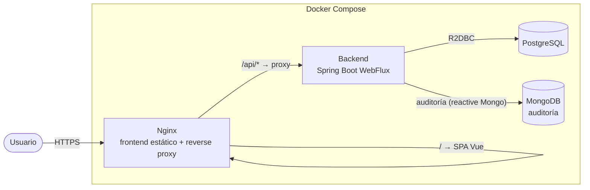

### 4.2 Flujo de una petición

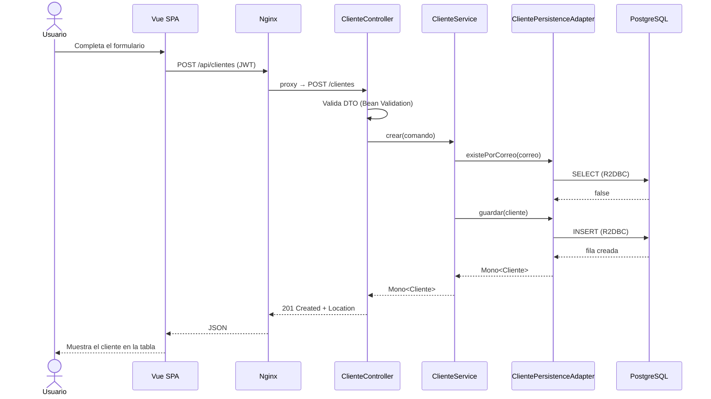

Toda la cadena es **no bloqueante**: ningún hilo del event loop espera a la BD.

---

## 5. Backend: DDD y arquitectura hexagonal reactiva

### 5.0 Descomposición DDD

**Contexto delimitado (bounded context):** *Gestión de Clientes*. Es el único contexto del PoC.

**Lenguaje ubicuo**

| Término | Significado |
|---|---|
| Cliente | Persona registrada en el sistema |
| Nombres / Apellidos | Datos de identificación de la persona |
| Correo | Dirección de contacto única por cliente |
| Teléfono | Número de contacto |
| Fecha de creación | Momento de alta, asignado por el sistema |
| Auditoría | Registro histórico de cada cambio sobre un cliente |

**Elementos tácticos**

| Elemento | Tipo DDD | Responsabilidad |
|---|---|---|
| `Cliente` | Agregado raíz / entidad | Identidad por `id`; protege sus invariantes |
| `Correo` | Value Object | Formato válido; igualdad por valor |
| `Telefono` | Value Object | Formato válido; igualdad por valor |
| `ClienteRepositoryPort` | Repositorio (puerto) | Persistir y recuperar el agregado |
| `AuditoriaPort` | Puerto de salida | Registrar eventos de cambio |
| `ClienteService` | Servicio de aplicación | Orquesta casos de uso; no contiene reglas de negocio |
| `ClienteNoEncontradoException`, `CorreoDuplicadoException` | Excepciones de dominio | Expresan violaciones de reglas en lenguaje del negocio |

**Casos de uso:** crear, listar, obtener por id, actualizar y eliminar cliente.

**Qué no se modela (por proporcionalidad):** eventos de dominio, sagas, múltiples agregados, CQRS. La auditoría se registra desde el servicio de aplicación, a través de un puerto.

### 5.1 Principios

- El **dominio** es el centro y no depende de nada (ni Spring, ni R2DBC, ni HTTP).
- La aplicación se comunica con el exterior mediante **puertos** (interfaces).
- La infraestructura implementa los puertos mediante **adaptadores**.
- La dependencia siempre apunta hacia adentro: `infrastructure → application → domain`.

### 5.2 Mapa hexagonal

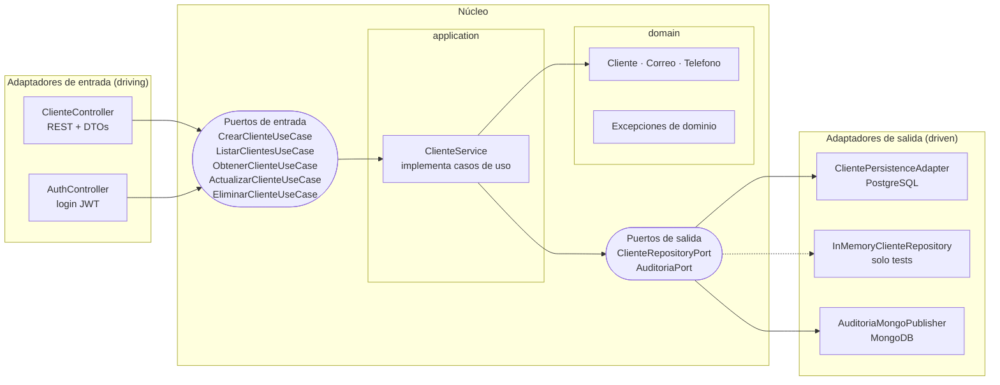

### 5.3 Estructura de paquetes

```
ms-cliente-crud/src/main/java/com/eykcorp/clientes/
├── domain/cliente/                      ← Java puro, sin librerías externas (ni Reactor)
│   ├── Cliente, Correo, Telefono
│   └── ClienteNoEncontradoException, CorreoDuplicadoException
├── application/                         ← solo reactor-core (ADR-010)
│   ├── port/in/    CrearClienteUseCase, ListarClientesUseCase, ObtenerClienteUseCase,
│   │               ActualizarClienteUseCase, EliminarClienteUseCase
│   ├── port/out/   ClienteRepositoryPort, AuditoriaPort
│   └── service/    ClienteService
└── infrastructure/
    ├── adapter/in/web/
    │   ├── ClienteController, AuthController
    │   ├── dto/      ClienteRequest, ClienteResponse
    │   ├── mapper/   ClienteWebMapper
    │   └── error/    GlobalExceptionHandler
    ├── adapter/out/persistence/
    │   ├── ClientePersistenceAdapter, ClienteEntity, ClienteR2dbcRepository
    │   └── mapper/   ClienteEntityMapper
    ├── adapter/out/audit/   AuditoriaMongoPublisher, AuditoriaDocument   (Épica 3)
    ├── security/            JwtService, SecurityConfig                 (Épica 2)
    └── config/              propiedades por variables de entorno

ms-cliente-crud/src/test/java/.../   InMemoryClienteRepository (doble de prueba) + tests
```

> El dominio se organiza **por agregado** (`domain/cliente`), no por tipo técnico, según la decisión D-03 del kit de arquitectura.

**Equivalencia con arquitectura "por capas"** (requisito del enunciado):

| Capa clásica | Paquete hexagonal |
|---|---|
| Controller | `infrastructure.adapter.in.web` |
| Service | `application.service` |
| Repository | `infrastructure.adapter.out.persistence` |
| Modelo / Entity | `domain.cliente` |
| DTO | `infrastructure.adapter.in.web.dto` |

### 5.4 Diagrama de clases

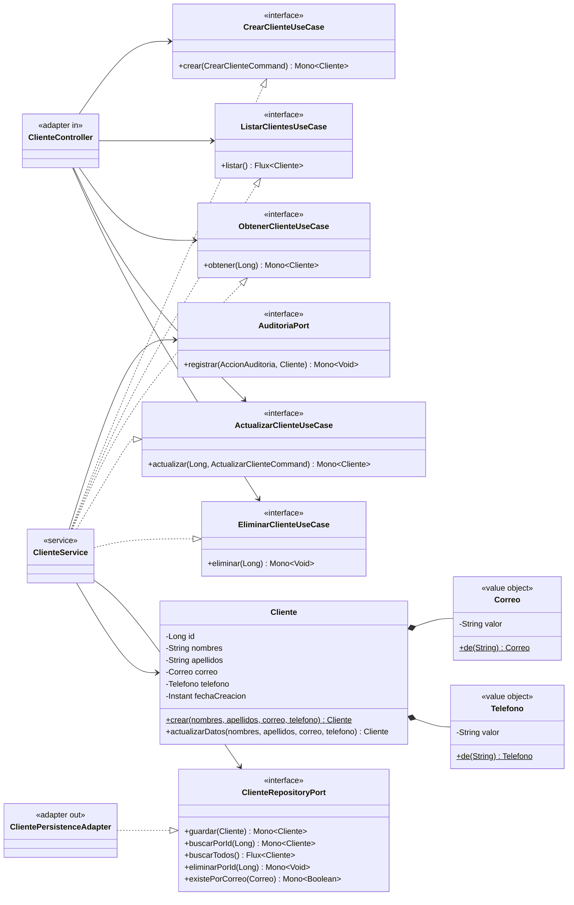

### 5.5 Reglas de dominio (invariantes)

- `nombres` y `apellidos` no pueden estar vacíos.
- `correo` debe tener formato válido y ser **único**.
- `fecha_creacion` la asigna el sistema y **no cambia** en un `PUT`.
- Eliminar un cliente inexistente devuelve 404.

### 5.6 Manejo global de errores

Un `@RestControllerAdvice` convierte excepciones de dominio y de validación a `ProblemDetail` (RFC 7807):

| Excepción | HTTP |
|---|---|
| `WebExchangeBindException` (validación del DTO) | 400 |
| `ClienteNoEncontradoException` | 404 |
| `CorreoDuplicadoException` | 409 |
| Error no controlado | 500 (sin filtrar detalles internos; se registra en logs) |

### 5.7 Logs

SLF4J con nivel configurable por variable de entorno. Se registran los casos de uso (crear, actualizar, eliminar) en `INFO`, y los errores inesperados en `ERROR`. Nunca se registran tokens ni datos sensibles.

### 5.8 Diagramas de comportamiento

**Ciclo de vida del cliente (estados)**

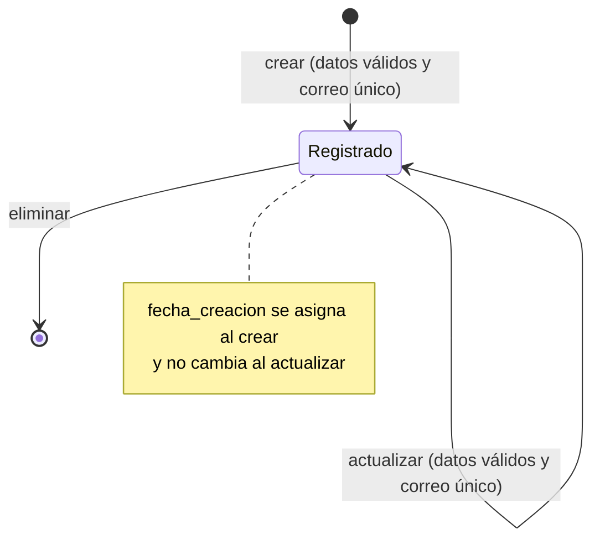

**Caso de uso "Crear cliente" (actividad)**

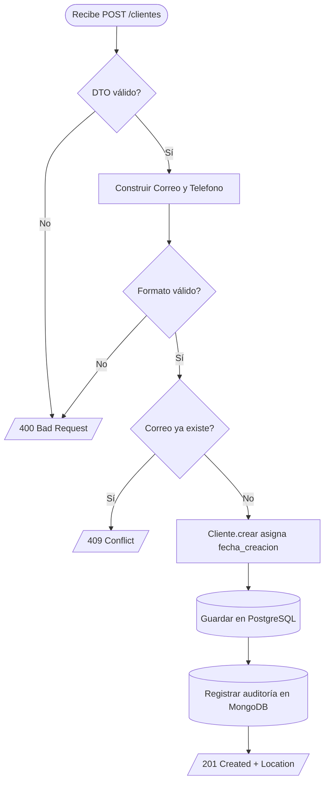

**Actualizar y eliminar con errores (secuencia)**

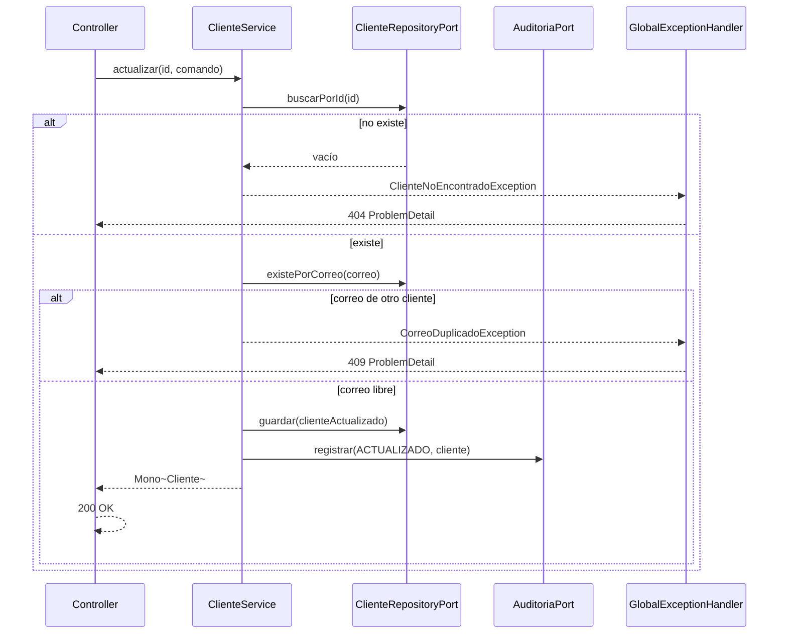

Si la auditoría falla, el cambio sobre el cliente **no se revierte**: el error se registra en logs y la operación sigue (auditoría de mejor esfuerzo). Queda documentado en ADR-011.

---

## 6. Frontend: arquitectura Vue 3

### 6.1 Principios

- **Componentes presentacionales** (sin lógica de negocio ni llamadas HTTP) y **vistas contenedoras**.
- La lógica de estado (lista, carga, error) vive en **composables**.
- Un **único punto de acceso HTTP** (`services/clienteService`) para facilitar pruebas y cambios.
- Sigue las reglas FE-01..08 del kit (`frontend-component`): presentacionales sin `fetch`, estado global solo si es compartido y props con validación de tipos.

### 6.2 Capas del frontend

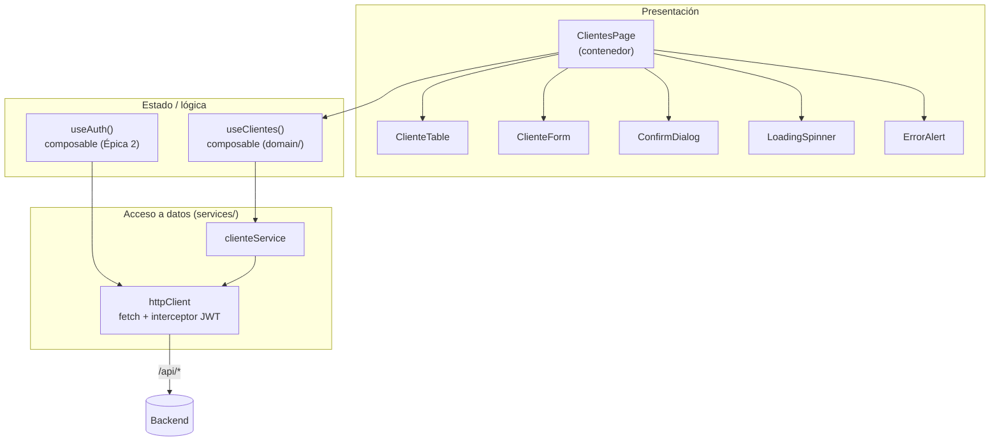

### 6.3 Estructura

```
web-cliente-crud/
├── src/
│   ├── domain/         useClientes.js, useAuth.js        (composables de lógica pura)
│   ├── services/       clienteService.js, httpClient.js  (puerto de salida hacia la API)
│   ├── components/     ClienteTable, ClienteForm, ConfirmDialog,
│   │                   LoadingSpinner, ErrorAlert        (presentacionales)
│   ├── pages/          ClientesPage, LoginPage           (contenedores)
│   ├── app/            router (con guard de autenticación), main.js
│   └── App.vue
├── tests/
│   ├── unit/           Vitest
│   └── e2e/            Playwright
├── nginx.conf
├── Dockerfile
└── README.md
```

### 6.4 Reactividad en el cliente

`ref` para el estado simple, `reactive` para el formulario, `computed` para derivados (por ejemplo, `hayClientes`) y `watch` solo para efectos secundarios. Todas las llamadas manejan los tres estados: **cargando**, **éxito** y **error**.

---

## 7. Patrones de diseño

| Patrón | Dónde se aplica | Para qué |
|---|---|---|
| **Arquitectura hexagonal** (Ports & Adapters) | Todo el backend | Aislar el dominio de la infraestructura |
| **Repository** | `ClienteRepositoryPort` + `ClientePersistenceAdapter` | Abstraer la persistencia |
| **Use Case / Command** | Interfaces `*UseCase` y comandos | Una intención de negocio por interfaz |
| **Adapter** | Controller y adaptador R2DBC | Traducir entre el mundo externo y los puertos |
| **DTO + Mapper** | `ClienteRequest/Response`, `*Mapper` | No exponer el modelo de dominio |
| **Value Object** | `Correo`, `Telefono` | Validar e imponer invariantes en el tipo |
| **Static Factory Method** | `Cliente.crear(...)` | Garantizar que un cliente nunca nace inválido |
| **Dependency Injection** (por constructor) | Todo Spring | Bajo acoplamiento y testabilidad |
| **Chain of Responsibility** | Filtros de Spring Security (JWT) | Procesar la petición en etapas |
| **Observer / Reactive Streams** | `Mono`/`Flux`; reactividad de Vue | Flujos asíncronos con backpressure |
| **Facade** | `clienteService` en el frontend | Una API simple sobre `fetch` |
| **Composable** (Composition API) | `useClientes`, `useAuth` | Reutilizar lógica con estado |
| **Container / Presentational** | `ClientesPage` vs componentes | Separar lógica de presentación |

Principios SOLID aplicados: **S** (un caso de uso por interfaz), **O** (nuevo adaptador sin tocar el dominio), **L/I** (puertos pequeños y sustituibles), **D** (el dominio define los puertos, la infraestructura los implementa).

---

## 8. Modelo de datos y contrato REST

### 8.1 Modelo de datos

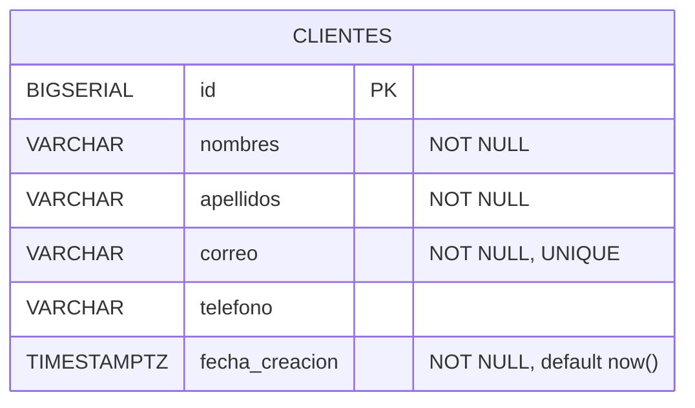

La tabla se crea con una migración Flyway versionada (`V1__crear_tabla_clientes.sql`).

### 8.2 Contrato REST

| Método | Ruta | Cuerpo | Éxito | Errores |
|---|---|---|---|---|
| POST | `/clientes` | `ClienteRequest` | `201` + `Location` | 400, 409 |
| GET | `/clientes` | — | `200` lista | — |
| GET | `/clientes/{id}` | — | `200` | 404 |
| PUT | `/clientes/{id}` | `ClienteRequest` | `200` | 400, 404, 409 |
| DELETE | `/clientes/{id}` | — | `204` | 404 |

**ClienteRequest**

```json
{
  "nombres": "Ana María",
  "apellidos": "Pérez Loor",
  "correo": "ana.perez@example.com",
  "telefono": "0991234567"
}
```

**ClienteResponse**

```json
{
  "id": 1,
  "nombres": "Ana María",
  "apellidos": "Pérez Loor",
  "correo": "ana.perez@example.com",
  "telefono": "0991234567",
  "fechaCreacion": "2026-10-05T15:30:00Z"
}
```

**Error (ProblemDetail)**

```json
{
  "type": "about:blank",
  "title": "Correo duplicado",
  "status": 409,
  "detail": "Ya existe un cliente con el correo ana.perez@example.com",
  "instance": "/clientes"
}
```

---

## 9. Seguridad (JWT)

*Épica 2. El CRUD queda completo y entregable sin ella.*

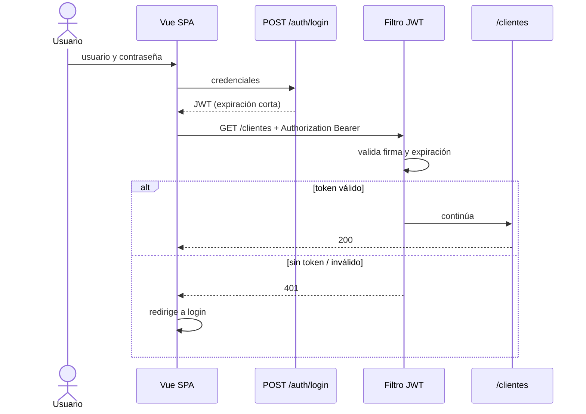

- **Autenticación:** `POST /auth/login` devuelve un JWT HS256.
- **Usuario:** un único administrador definido por variables de entorno, con contraseña en BCrypt. Sin tabla de usuarios por ahora.
- **Autorización:** todos los endpoints `/clientes/**` requieren token válido.
- **CORS:** en producción no hace falta, porque Nginx sirve el frontend y la API bajo el mismo origen. En desarrollo local se permite el origen de Vite.
- **HTTPS:** se termina en Nginx (certificado local autofirmado en dev, certificado real en producción).
- **Secretos:** nunca en el repositorio; el repo solo incluye `.env.example`.

---

## 10. Dockerización y despliegue

### 10.1 Topología


Solo Nginx publica un puerto al host. Backend y bases de datos son accesibles únicamente dentro de la red del Compose.

### 10.2 Servicios

| Servicio | Imagen | Notas |
|---|---|---|
| `postgres` | `postgres:16.15-alpine` | Volumen persistente, `healthcheck` con `pg_isready` |
| `ms-cliente-crud` | Build propio (multi-stage) | Usuario no root, `depends_on: postgres (service_healthy)`, `healthcheck` en actuator |
| `web-cliente-crud` | Build propio (Node → Nginx) | Sirve la SPA y hace reverse proxy `/api` → `ms-cliente-crud` |
| `mongo` | `mongo:7` | Volumen persistente, `healthcheck`; el backend lo usa para auditoría (Épica 3) |

### 10.3 Variables de entorno (`.env.example`)

| Variable | Ejemplo | Usada por |
|---|---|---|
| `POSTGRES_DB` | `clientes` | postgres, backend |
| `POSTGRES_USER` | `clientes_app` | postgres, backend |
| `POSTGRES_PASSWORD` | `cambiar-esto` | postgres, backend |
| `SPRING_R2DBC_URL` | `r2dbc:postgresql://postgres:5432/clientes` | backend |
| `SPRING_FLYWAY_URL` | `jdbc:postgresql://postgres:5432/clientes` | backend |
| `SPRING_DATA_MONGODB_URI` | `mongodb://mongo:27017/auditoria` | backend |
| `LOG_LEVEL` | `INFO` | backend |
| `JWT_SECRET` | *(mínimo 32 caracteres)* | backend |
| `JWT_EXPIRATION_MINUTES` | `30` | backend |
| `ADMIN_USER` / `ADMIN_PASSWORD_HASH` | | backend |
| `AWS_ENDPOINT_URL` | `http://localstack:4566` | backend (solo perfil `aws`) |
| `AWS_REGION` / `AWS_ACCESS_KEY_ID` / `AWS_SECRET_ACCESS_KEY` | `us-east-1` / `test` / `test` | backend y LocalStack (credenciales ficticias) |

### 10.4 Configuración de Nginx

- Sirve los archivos estáticos de la SPA con `try_files` hacia `index.html` (rutas del router).
- `location /api/` hace `proxy_pass` hacia `http://ms-cliente-crud:8080/`.
- Cabeceras de seguridad básicas y compresión gzip.
- HTTPS con certificado montado como volumen.

### 10.5 Simulación de AWS en local (LocalStack)

El enunciado lista AWS en el stack. En vez de usar una cuenta real, se emula localmente con **LocalStack**, que expone la API de AWS en `http://localhost:4566`. Docker Compose sigue siendo la forma principal de levantar la aplicación; LocalStack es un servicio más, activable con el perfil `aws`.

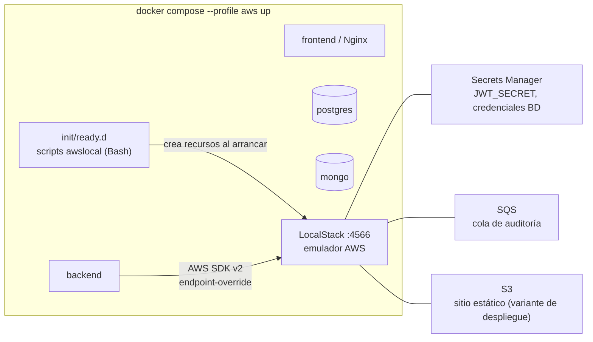

| Servicio AWS | Uso en el proyecto | Adaptador (hexagonal) |
|---|---|---|
| **Secrets Manager** | El backend lee `JWT_SECRET` y credenciales de BD al arrancar, en vez de variables de entorno planas | Configuración en `infrastructure/config` |
| **SQS** | La auditoría se publica en una cola y un consumidor la guarda en MongoDB, desacoplando la escritura | `AuditoriaSqsPublisher` (implementa `AuditoriaPort`) |
| **S3** | Variante de despliegue del frontend: `aws s3 sync dist/` a un bucket con hosting estático | Script de despliegue, no es código de la app |

- **El dominio no cambia:** AWS entra solo como adaptadores de salida. En producción real basta con quitar `AWS_ENDPOINT_URL`.
- **Perfil `aws` de Spring:** activa los adaptadores de AWS. Sin él, la auditoría escribe directo a MongoDB y los secretos vienen del `.env`.
- **Aprovisionamiento:** scripts Bash con `awslocal` en `localstack/init/ready.d/`, que crean el secreto, la cola y el bucket al iniciar el contenedor.
- **Limitación conocida:** RDS y ECS/Fargate no se emulan en la versión gratuita estable. PostgreSQL y los contenedores siguen corriendo en Docker Compose.
- **Versión y licencia:** desde el 23 de marzo de 2026 la imagen `localstack/localstack:latest` exige un token de cuenta. Para que cualquier evaluador pueda ejecutar el repo sin registrarse, se **fija la versión sin token** (`localstack/localstack:4.4.0`). Ver ADR-014.
- **CI:** el workflow de GitHub Actions levanta LocalStack como servicio y ejecuta los tests de integración del perfil `aws`.

---

## 11. Estrategia de pruebas

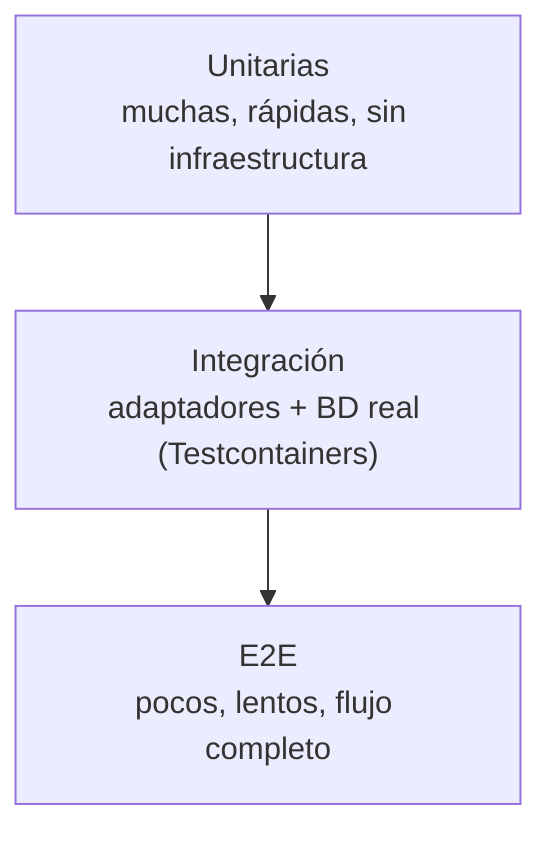

| Nivel | Backend | Frontend |
|---|---|---|
| **Unitario** | Dominio (JUnit 5); `ClienteService` con Mockito y `StepVerifier` | Vitest + Vue Test Utils: componentes, composables, `clienteApi` con `fetch` simulado |
| **Slice** | `@WebFluxTest` + `WebTestClient`: controller y `GlobalExceptionHandler` | Vista montada con MSW como API simulada |
| **Integración** | Testcontainers + PostgreSQL y MongoDB: adaptadores R2DBC y Mongo, migraciones Flyway. Test de **contrato compartido** que corre contra `InMemoryClienteRepository` y contra el adaptador real | — |
| **Arquitectura** | ArchUnit: el dominio no depende de Spring ni de infraestructura | — |
| **E2E** | `@SpringBootTest` con puerto real + Testcontainers: CRUD completo, 400, 404, 409, 401 | Playwright contra el stack de Compose: crear, editar, eliminar, error, carga |

Regla de trabajo: **TDD**. Cada historia empieza con un test que falla (RED), se implementa lo mínimo (GREEN) y se refactoriza. El historial de Git lo refleja con commits separados.

---

## 12. Plan de entrega: épicas e historias

Las historias detalladas, con criterios de aceptación, se escriben en `docs/historias/` antes de implementar. Este es el esquema.

| Épica | Historias | Resultado |
|---|---|---|
| **E0 · Fundación** | Monorepo y `.gitignore`; Compose base con Postgres; CI vacío que compila | Repo ejecutable |
| **E1 · CRUD Clientes** | Dominio y puertos; casos de uso; adaptador R2DBC + Flyway; controller, DTOs y errores; frontend (lista, formulario, eliminar, errores, carga); Nginx + Dockerfiles; tests unitarios, de integración y e2e | Entregable mínimo completo |
| **E2 · Seguridad JWT** | Login y filtro JWT en backend; login y guard en frontend; tests 401/403 | API protegida |
| **E3 · Auditoría MongoDB** | `AuditoriaPort` + adaptador Mongo reactivo; servicio `mongo` en Compose; tests de integración y e2e | Segunda persistencia |
| **E4 · AWS local (LocalStack)** | Servicio LocalStack en Compose (perfil `aws`); scripts de init; lectura de secretos desde Secrets Manager; `AuditoriaSqsPublisher` + consumidor; script de despliegue del frontend a S3; tests de integración contra LocalStack | Stack AWS simulado |
| **E5 · Entrega** | READMEs de backend y frontend; ADRs; revisión de seguridad y de código; limpieza del historial | Listo para presentar |

**Trazabilidad requisito → historia → prueba** (se completa en `docs/requerimientos/`):

| Requisito | Historia | Prueba |
|---|---|---|
| CRUD de clientes | E1 | e2e backend y frontend |
| DTOs y validaciones | E1 | `@WebFluxTest` |
| Manejo global de excepciones | E1 | `@WebFluxTest` |
| Logs básicos | E1 | revisión de código |
| Variables de entorno | E0/E1 | `docker compose config` |
| Dockerfile / Compose funcional | E0/E1 | job e2e en CI |
| Estados de carga y error (frontend) | E1 | Vitest + Playwright |

---

## 13. Estructura del monorepo

```
ec-eykcorp/
├── README.md                    ← este documento
├── docker-compose.yml
├── .env.example
├── .gitignore
├── .github/workflows/ci.yml
├── docs/
│   ├── requerimientos/
│   ├── historias/
│   ├── arquitectura/            ← ADRs
│   └── pruebas/
├── ms-cliente-crud/             ← backend, README propio
└── web-cliente-crud/            ← frontend, README propio
```

---

### 13.1 Nombres y versionado de componentes

| Tipo | Patrón | Componente | Imagen Docker |
|---|---|---|---|
| Microservicio | `ms-<dominio>-<funcionalidad>` | `ms-cliente-crud` | `eykcorp/ms-cliente-crud:0.1.0` |
| Aplicación web | `web-<dominio>-<funcionalidad>` | `web-cliente-crud` | `eykcorp/web-cliente-crud:0.1.0` |

- **Versionado semántico** (`MAJOR.MINOR.PATCH`) independiente por componente: `version` en `build.gradle.kts` y en `package.json`; la misma versión etiqueta la imagen Docker. Arrancan en `0.1.0` y pasan a `1.0.0` al cerrar la Épica 5.
- **Versiones fijadas:** Spring Boot, plugins de Gradle, dependencias y imágenes base se declaran con versión exacta (nada de `latest`), para que el build sea reproducible.
- Los servicios de Compose usan el nombre del componente (`ms-cliente-crud`, `web-cliente-crud`); `postgres`, `mongo` y `localstack` conservan el de su tecnología.
- El paquete Java raíz sigue siendo `com.eykcorp.clientes`.

---

## 14. Cómo ejecutar

> Disponible cuando se complete la Épica 1. Los comandos finales se confirmarán al implementarla.

```bash
cp .env.example .env            # ajustar secretos
docker compose up --build       # levanta postgres, backend y frontend
# Aplicación: http://localhost:8080
```

**Pruebas**

```bash
cd ms-cliente-crud  && ./gradlew check  # unitarias, integración, e2e y ArchUnit
cd web-cliente-crud && npm test         # Vitest
cd web-cliente-crud && npm run e2e      # Playwright (requiere el stack levantado)
```

---

## 15. Decisiones de arquitectura (ADR)

| # | Decisión | Motivo | Alternativa descartada |
|---|---|---|---|
| 001 | Hexagonal liviana, un agregado | Cumple "por capas" y aísla el dominio sin sobreingeniería | CQRS / event sourcing: excesivo para un CRUD |
| 002 | WebFlux + R2DBC | Reactividad real de punta a punta | JPA/JDBC: bloquearía el event loop |
| 003 | Flyway con JDBC solo al arrancar | R2DBC no migra esquemas | Scripts manuales: no reproducible |
| 004 | Vue 3 + Vite | El enunciado pide una SPA | Astro: orientado a contenido estático |
| 005 | Nginx como reverse proxy | Mismo origen, sin CORS en producción | Exponer backend directo |
| 006 | Borrado físico | El enunciado dice "eliminar" | Borrado lógico (se puede añadir luego) |
| 007 | JWT con usuario único por entorno | Seguridad básica sin gestión de usuarios | Tabla de usuarios y roles: fuera de alcance |
| 008 | MongoDB en Docker solo para auditoría | Único caso donde un documento aporta valor real; demuestra un segundo adaptador de salida | Usarlo para clientes: sin justificación |
| 009 | Documentación y dominio en español; infraestructura en inglés | El contrato define los campos en español | — |
| 010 | `reactor-core` (solo `reactor.core..`) permitido únicamente en `application`; el dominio queda sin librerías externas | Los puertos reactivos devuelven `Mono`/`Flux`; el kit no contempla Reactor y se declara aquí como excepción | Puertos síncronos con adaptadores que convierten: pierde el flujo reactivo |
| 011 | Auditoría de mejor esfuerzo | Un fallo de Mongo no debe impedir operar clientes | Auditoría transaccional entre Postgres y Mongo: complejidad excesiva |
| 014 | LocalStack fijado en 4.4.0 (sin token) para simular AWS | Cualquiera puede clonar y ejecutar sin cuenta; `latest` exige token desde marzo 2026 | `latest` con token: obliga a cada evaluador a registrarse |
| 015 | Servicios AWS acotados a Secrets Manager, SQS y S3 | Tienen uso real en la app y están disponibles sin licencia; RDS/ECS no | Emular RDS/ECS: requiere plan de pago |
| 016 | Nombres `ms-<dominio>-<funcionalidad>` / `web-<dominio>-<funcionalidad>` y SemVer por componente | Identifica tipo y propósito de cada artefacto y permite versionarlos por separado | Nombres genéricos `backend`/`frontend` |
| 013 | Gradle (Kotlin DSL) con toolchain Java 17 | Compila siempre con 17 aunque el JDK local sea otro; builds incrementales | Maven: válido, pero sin toolchain tan directo |
| 012 | Adaptador en memoria solo para tests | Pruebas rápidas y test de contrato compartido | H2 con R2DBC: no aporta frente a Testcontainers |
