# ec-eykcorp · Plataforma de Clientes (PoC Fullstack)

Prueba de concepto de un **CRUD de clientes** con backend reactivo en arquitectura hexagonal, frontend SPA en Vue 3 y despliegue dockerizado.

> Estado: **v0.2.0, implementado y verificado** (ver [Estado de la entrega](#estado-de-la-entrega)). Este documento recoge los requerimientos, la arquitectura y las decisiones; cada microservicio tiene además su propio README.

## Primer uso: levantar la aplicación y entrar

Guía rápida para quien clona el repositorio por primera vez.

**Requisitos:** Docker y Docker Compose v2 (nada más: Java y Node no hacen falta). Funciona en Intel y en Apple Silicon.

```bash
git clone https://github.com/edzamo/ec-eykcorp.git
cd ec-eykcorp

./scripts/init-env.sh          # crea el archivo .env (secretos aleatorios + usuario de demostración)
docker compose up --build      # construye y levanta PostgreSQL, MongoDB, el backend y el frontend
```

La primera vez tarda unos minutos porque compila el backend y el frontend dentro de Docker. Cuando termine, abre **http://localhost:8080**.

### Credenciales de demostración

| Campo | Valor |
|---|---|
| Usuario | `admin` |
| Contraseña | `Eyk-Demo-2026` |

> **Solo para uso local y evaluación.** Son credenciales públicas, escritas aquí a propósito para poder entrar sin configurar nada. **Nunca** se usan en otro entorno: allí define tu propia contraseña con `ADMIN_PASSWORD='tu-contraseña' ./scripts/init-env.sh --force`. Las contraseñas de las bases de datos y el secreto del token (JWT) **no** son estas: se generan aleatorias en tu `.env`, que está ignorado por git y no se sube nunca.

### Qué vas a ver

1. Una pantalla de **inicio de sesión**: entra con las credenciales de arriba.
2. La lista de **clientes**, donde puedes crear, editar y eliminar (con confirmación). Se muestran estados de carga y mensajes de error.
3. Cada alta, cambio o baja queda registrado en la **auditoría** de MongoDB.

### Comprobar que todo funciona

```bash
ADMIN_USER=admin ADMIN_PASSWORD='Eyk-Demo-2026' ./scripts/smoke-test.sh
```

Ejecuta 14 comprobaciones sobre el sistema completo (página, proxy, 401, login, CRUD, validaciones y duplicados). Debe terminar con "Todo en orden."

### Apagar y empezar de cero

```bash
docker compose down          # apaga; conserva los datos
docker compose down -v       # apaga y borra los datos (clientes y auditoría)
```

### Si algo falla

| Síntoma | Causa y solución |
|---|---|
| `Ya existe …/.env` | Ya tienes uno. Usa `./scripts/init-env.sh --force` para regenerarlo (borra el anterior). |
| `required variable … is missing` al levantar | Falta el `.env`: ejecuta `./scripts/init-env.sh`. |
| El puerto 8080 está ocupado | Cierra lo que lo use o cambia `"8080:8080"` en `docker-compose.yml`. |
| Al iniciar sesión sale "Too Many Requests" (429) | Nginx limita el login a 5 intentos por minuto por IP; espera un minuto. |
| Cambié la contraseña en `.env` y no funciona | El backend la lee al arrancar: `docker compose up -d --force-recreate ms-cliente-gestion`. |
| Error `no match for platform` al construir | Estás usando una versión antigua del repo; las imágenes actuales son multiplataforma (amd64 y arm64). |

Más detalle de cada pieza: [`ms-cliente-gestion`](ms-cliente-gestion/README.md) (backend) y [`ms-cliente-presentacion`](ms-cliente-presentacion/README.md) (frontend).

---

## Índice

0. [Primer uso: levantar la aplicación y entrar](#primer-uso-levantar-la-aplicación-y-entrar)
1. [Objetivo y alcance](#1-objetivo-y-alcance)
2. [Requerimientos](#2-requerimientos)
3. [Stack tecnológico](#3-stack-tecnológico)
4. [Vista general de la arquitectura](#4-vista-general-de-la-arquitectura)
5. [Backend: DDD y arquitectura hexagonal reactiva](#5-backend-ddd-y-arquitectura-hexagonal-reactiva)
6. [Frontend: arquitectura Vue 3](#6-frontend-arquitectura-vue-3)
7. [Patrones de diseño](#7-patrones-de-diseño)
8. [Modelo de datos y contrato REST](#8-modelo-de-datos-y-contrato-rest)
9. [Seguridad (JWT)](#9-seguridad-jwt)
10. [Dockerización y despliegue](#10-dockerización-y-despliegue)
11. [Estrategia de pruebas](#11-estrategia-de-pruebas)
12. [Plan de entrega: épicas e historias](#12-plan-de-entrega-épicas-e-historias)
13. [Estructura del monorepo](#13-estructura-del-monorepo)
14. [Cómo ejecutar](#14-cómo-ejecutar)
15. [Decisiones de arquitectura (ADR)](#15-decisiones-de-arquitectura-adr)

---

## 1. Objetivo y alcance

Desarrollar una aplicación fullstack básica con las tecnologías principales del stack de la empresa, demostrando arquitectura, buenas prácticas y capacidad de análisis.

| Dentro del alcance | Fuera del alcance (por ahora) |
|---|---|
| CRUD de clientes (backend + frontend) | SOAP XML |
| Programación reactiva de punta a punta | Despliegue en una cuenta AWS real (se simula en local, Épica 4) |
| Arquitectura hexagonal en el backend | Registro de usuarios, refresh tokens, roles múltiples |
| JWT básico (Épica 2) | Paginación y búsqueda avanzada |
| Docker + Docker Compose + Nginx | Observabilidad avanzada (trazas distribuidas) |
| Pruebas unitarias, de integración y e2e | |
| CI con GitHub Actions | |
| Auditoría en MongoDB (Épica 3) | |
| Simulación local de AWS con LocalStack (Épica 4) | |

---

## 2. Requerimientos

Resumen de los requerimientos de la prueba técnica de desarrollador fullstack (parte práctica).

### 2.1 Backend

Microservicio con **Java 17, Spring Boot 3, PostgreSQL y Docker**.

**Entidad Cliente**

| Campo | Descripción |
|---|---|
| `id` | Identificador |
| `nombres` | Nombres del cliente |
| `apellidos` | Apellidos del cliente |
| `correo` | Correo electrónico |
| `telefono` | Teléfono |
| `fecha_creacion` | Fecha de creación del registro |

**Endpoints**

| Operación | Método y ruta |
|---|---|
| Crear cliente | `POST /clientes` |
| Listar clientes | `GET /clientes` |
| Obtener cliente por id | `GET /clientes/{id}` |
| Actualizar cliente | `PUT /clientes/{id}` |
| Eliminar cliente | `DELETE /clientes/{id}` |

**Requerimientos técnicos obligatorios:** arquitectura por capas, uso correcto de DTOs, validaciones, manejo global de excepciones, logs básicos, variables de entorno, Dockerfile funcional y Docker Compose funcional.

### 2.2 Frontend

SPA con **Vue o Astro** (este proyecto usa Vue 3).

- Funcionalidades: listar, crear, editar y eliminar clientes; mostrar mensajes de error; mostrar estados de carga.
- Requerimientos técnicos: componentes reutilizables, buenas prácticas, consumo correcto de la API REST, organización adecuada del proyecto.

### 2.3 Entregables

- Código fuente completo en repositorio Git público.
- Instrucciones de ejecución.
- README técnico con pasos de ejecución, estructura del proyecto y consideraciones técnicas.
- Docker Compose funcional.
- Historial de Git que refleje el proceso de desarrollo.

### 2.4 Requerimientos añadidos por este proyecto

Decisiones propias que van más allá del enunciado original:

- Programación reactiva de punta a punta (WebFlux + R2DBC).
- Arquitectura hexagonal con regla de dependencias verificada por tests.
- Pruebas unitarias, de integración y e2e en backend y frontend.
- JWT para proteger la API (Épica 2).
- Documentación con diagramas UML versionados como código (Mermaid).

### 2.5 Acceso a la aplicación y credenciales por defecto

Requerimiento de seguridad y de usabilidad añadido por este proyecto:

- La API y la interfaz exigen autenticación (JWT). No hay endpoints de negocio públicos.
- Debe existir un **usuario por defecto documentado** para poder evaluar el sistema sin configuración manual: `admin` con la contraseña de demostración del [manual de primer uso](#primer-uso-levantar-la-aplicación-y-entrar).
- **Ningún secreto real se versiona.** Las credenciales de las bases de datos y el secreto JWT son aleatorios por instalación (`scripts/init-env.sh`) y viven solo en `.env`, ignorado por git. En la aplicación, la contraseña del administrador se guarda únicamente como hash BCrypt (`ADMIN_PASSWORD_HASH`), nunca en claro.
- La contraseña de demostración es **pública**: solo es válida en entornos locales y de evaluación. En cualquier otro entorno se sustituye con `ADMIN_PASSWORD`.

---

## 3. Stack tecnológico

| Capa | Tecnología | Motivo |
|---|---|---|
| Backend | Java 17, Spring Boot 3, **Spring WebFlux** | Programación reactiva (`Mono`/`Flux`) |
| Persistencia | PostgreSQL, **Spring Data R2DBC** | Acceso no bloqueante a la BD |
| Migraciones | Flyway (JDBC solo al arrancar) | R2DBC no incluye migraciones |
| Seguridad | Spring Security WebFlux + JWT (HS256) | Épica 2 |
| Build | **Gradle** (Kotlin DSL + wrapper versionado) | Builds incrementales y toolchain de Java 17 fijado en el build |
| Frontend | Vue 3 (Composition API), Vite, JavaScript | SPA ligera |
| UI | Bootstrap 5, HTML5, CSS3 | Parte del stack |
| Servidor web | Nginx | Sirve el frontend y hace reverse proxy a la API |
| Contenedores | Docker, Docker Compose | Entorno reproducible |
| Pruebas backend | JUnit 5, Mockito, Reactor `StepVerifier`, `WebTestClient`, Testcontainers, ArchUnit | |
| Pruebas frontend | Vitest, Vue Test Utils, MSW; ESLint y Prettier | |
| CI/CD | GitHub Actions | |
| Auditoría | MongoDB (Spring Data Reactive MongoDB), en contenedor Docker | Registro de cambios sobre clientes (Épica 3) |
| AWS local | LocalStack 4.4.0 + AWS SDK v2 (Secrets Manager, SQS, S3) | Simula AWS sin cuenta real (Épica 4) |
| Dobles de prueba | Adaptador en memoria (`ConcurrentHashMap`) | Test de contrato compartido con el adaptador real |

---

## 4. Vista general de la arquitectura

### 4.1 Contexto del sistema

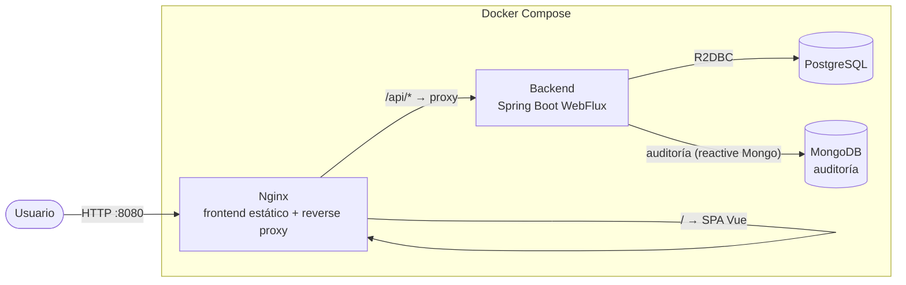

### 4.2 Flujo de una petición

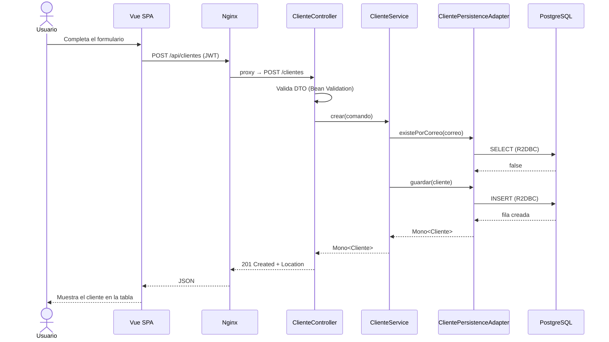

Toda la cadena es **no bloqueante**: ningún hilo del event loop espera a la BD.

---

## 5. Backend: DDD y arquitectura hexagonal reactiva

### 5.0 Descomposición DDD

**Contexto delimitado (bounded context):** *Gestión de Clientes*. Es el único contexto del PoC.

**Lenguaje ubicuo**

| Término | Significado |
|---|---|
| Cliente | Persona registrada en el sistema |
| Nombres / Apellidos | Datos de identificación de la persona |
| Correo | Dirección de contacto única por cliente |
| Teléfono | Número de contacto |
| Fecha de creación | Momento de alta, asignado por el sistema |
| Auditoría | Registro histórico de cada cambio sobre un cliente |

**Elementos tácticos**

| Elemento | Tipo DDD | Responsabilidad |
|---|---|---|
| `Cliente` | Agregado raíz / entidad | Identidad por `id`; protege sus invariantes |
| `Correo` | Value Object | Formato válido; igualdad por valor |
| `Telefono` | Value Object | Formato válido; igualdad por valor |
| `ClienteRepositoryPort` | Repositorio (puerto) | Persistir y recuperar el agregado |
| `AuditoriaPort` | Puerto de salida | Registrar eventos de cambio |
| `ClienteService` | Servicio de aplicación | Orquesta casos de uso; no contiene reglas de negocio |
| `ClienteNoEncontradoException`, `CorreoDuplicadoException` | Excepciones de dominio | Expresan violaciones de reglas en lenguaje del negocio |

**Casos de uso:** crear, listar, obtener por id, actualizar y eliminar cliente.

**Qué no se modela (por proporcionalidad):** eventos de dominio, sagas, múltiples agregados, CQRS. La auditoría se registra desde el servicio de aplicación, a través de un puerto.

### 5.1 Principios

- El **dominio** es el centro y no depende de nada (ni Spring, ni R2DBC, ni HTTP).
- La aplicación se comunica con el exterior mediante **puertos** (interfaces).
- La infraestructura implementa los puertos mediante **adaptadores**.
- La dependencia siempre apunta hacia adentro: `infrastructure → application → domain`.

### 5.2 Mapa hexagonal

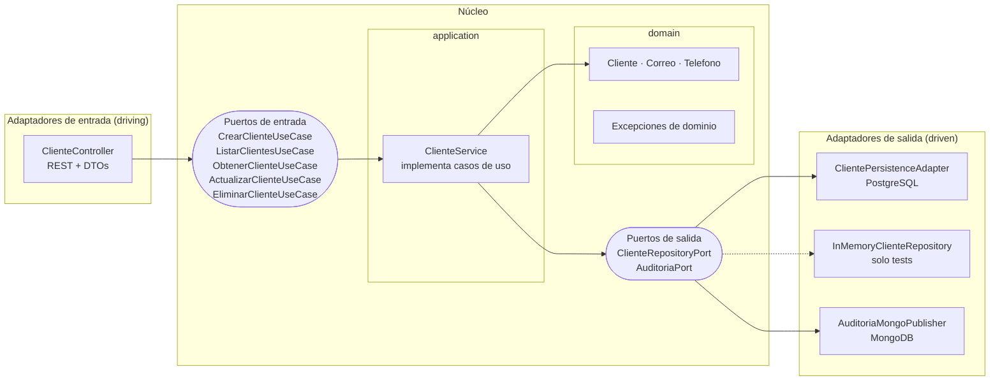

### 5.3 Estructura de paquetes

```
ms-cliente-gestion/src/main/java/com/eykcorp/clientes/
├── domain/cliente/                 Java puro, sin librerías externas (ni Reactor)
│   ├── Cliente, Correo, Telefono, AccionAuditoria
│   └── DomainException, ValorInvalidoException,
│       ClienteNoEncontradoException, CorreoDuplicadoException
├── application/
│   ├── command/    DatosCliente
│   ├── port/in/    CrearClienteUseCase, ListarClientesUseCase, ObtenerClienteUseCase,
│   │               ActualizarClienteUseCase, EliminarClienteUseCase      (solo interfaces)
│   ├── port/out/   ClienteRepositoryPort, AuditoriaPort                   (solo interfaces)
│   └── service/    ClienteService
└── infrastructure/
    ├── adapter/in/web/
    │   ├── controller/   ClienteController, AuthController
    │   ├── dto/request/  ClienteRequest, LoginRequest
    │   ├── dto/response/ ClienteResponse, LoginResponse
    │   ├── mapper/       ClienteWebMapper
    │   └── exception/    GlobalExceptionHandler, CredencialesInvalidasException
    ├── adapter/out/persistence/  ClientePersistenceAdapter, ClienteEntity,
    │                             ClienteR2dbcRepository, ClienteEntityMapper
    ├── adapter/out/audit/        AuditoriaMongoPublisher, AuditoriaDocument, AuditoriaDocumentMapper
    └── security/                 SecurityConfig, JwtService, JwtProperties, AdminProperties,
                                  AutenticadorAdministrador, ProblemaSeguridadHandler, TokenEmitido

ms-cliente-gestion/src/test/java/...  dobles en memoria (InMemoryClienteRepository, FakeAuditoriaPort),
                                      contratos compartidos y pruebas de arquitectura
```

> El dominio se organiza **por agregado** (`domain/cliente`), no por tipo técnico. Esta estructura corresponde al estado tras fusionar `refactor/organizacion-paquetes-web` y `refactor/puertos-solo-interfaces`.

**Equivalencia con arquitectura "por capas"** (requisito del enunciado):

| Capa clásica | Paquete hexagonal |
|---|---|
| Controller | `infrastructure.adapter.in.web.controller` |
| Service | `application.service` |
| Repository | `infrastructure.adapter.out.persistence` |
| Modelo / Entity | `domain.cliente` |
| DTO | `infrastructure.adapter.in.web.dto` (`request` y `response`) |

### 5.4 Diagrama de clases

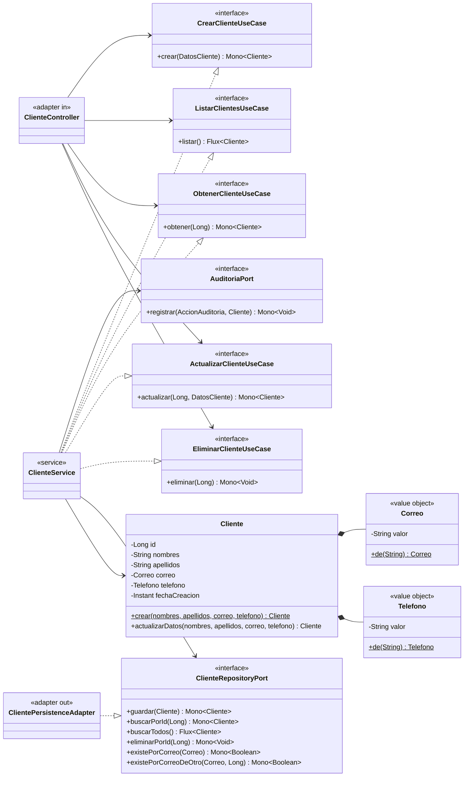

### 5.5 Reglas de dominio (invariantes)

- `nombres` y `apellidos` no pueden estar vacíos.
- `correo` debe tener formato válido y ser **único**.
- `fecha_creacion` la asigna el sistema y **no cambia** en un `PUT`.
- Eliminar un cliente inexistente devuelve 404.

### 5.6 Manejo global de errores

`GlobalExceptionHandler` (`@RestControllerAdvice`) convierte excepciones a `ProblemDetail` (RFC 7807). Los 401 y 403 de Spring Security los traduce `ProblemaSeguridadHandler` con el mismo formato.

| Excepción | HTTP |
|---|---|
| `WebExchangeBindException` (validación del DTO, con `errores` por campo) | 400 |
| `ValorInvalidoException` (correo o teléfono con formato inválido) | 400 |
| `CredencialesInvalidasException` (login) | 401 |
| Sin token o token inválido/expirado (Spring Security) | 401 |
| Token válido sin permiso para la ruta | 403 |
| `ClienteNoEncontradoException` | 404 |
| `CorreoDuplicadoException`, y `DataIntegrityViolationException` por la restricción `uk_clientes_correo` (alta concurrente) | 409 |
| `ResponseStatusException` (JSON mal formado, id no numérico, ruta inexistente) | conserva su estado (400/404…) |
| Error no controlado | 500 (sin filtrar detalles internos; se registra en logs) |

### 5.7 Logs

SLF4J (con la anotación `@Slf4j` de Lombok) y nivel configurable por variable de entorno (`LOG_LEVEL` para la raíz, `APP_LOG_LEVEL` para el paquete de la aplicación). Los servicios y controllers registran cada operación: `INFO` para los cambios ("Cliente creado id=…"), `DEBUG` para el detalle de cada caso de uso, `WARN` para fallos tolerados (auditoría no registrada, login fallido) y `ERROR` para lo inesperado. **Nunca** se registran datos personales, contraseñas ni tokens: solo ids y acciones, y hay pruebas que lo comprueban.

### 5.8 Diagramas de comportamiento

**Ciclo de vida del cliente (estados)**

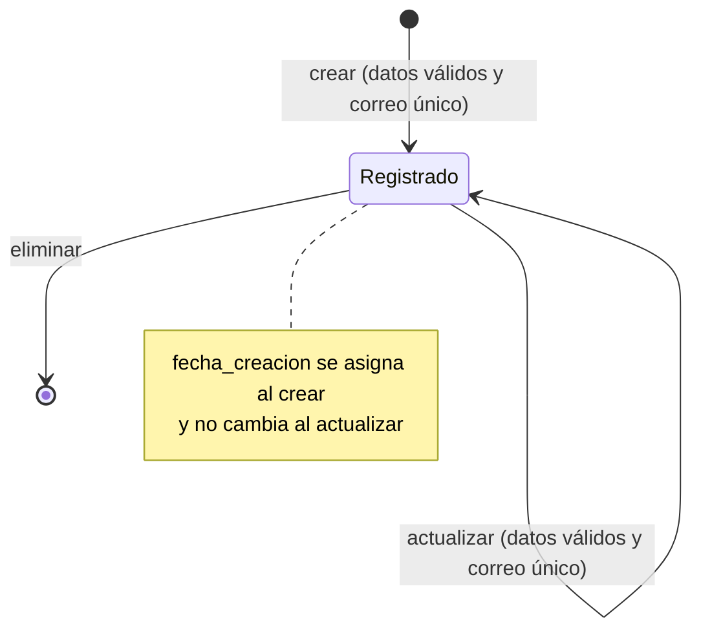

**Caso de uso "Crear cliente" (actividad)**


**Actualizar y eliminar con errores (secuencia)**

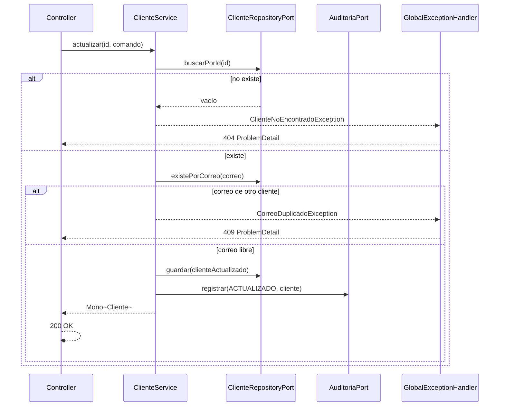

Si la auditoría falla, el cambio sobre el cliente **no se revierte**: el error se registra en logs y la operación sigue (auditoría de mejor esfuerzo). Queda documentado en ADR-011.

---

## 6. Frontend: arquitectura Vue 3

### 6.1 Principios

- **Componentes presentacionales** (sin lógica de negocio ni llamadas HTTP) y **vistas contenedoras**.
- La lógica de estado (lista, carga, error) vive en **composables**.
- Un **único punto de acceso HTTP** (`services/clienteService`) para facilitar pruebas y cambios.
- Reglas de diseño del frontend: presentacionales sin `fetch`, estado global solo si es compartido y props con validación de tipos.

### 6.2 Capas del frontend

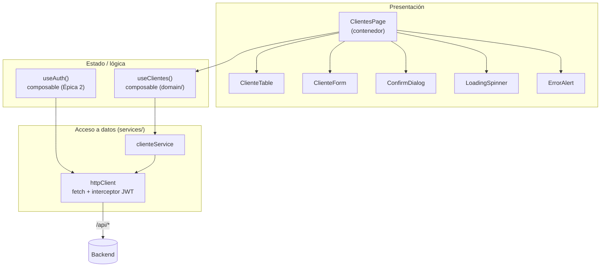

### 6.3 Estructura

```
ms-cliente-presentacion/
├── src/
│   ├── domain/         useClientes.js, useAuth.js        (composables de lógica pura)
│   ├── services/       clienteService.js, httpClient.js  (puerto de salida hacia la API)
│   ├── components/     ClienteTable, ClienteForm, ConfirmDialog,
│   │                   LoadingSpinner, ErrorAlert        (presentacionales)
│   ├── pages/          ClientesPage, LoginPage           (contenedores)
│   ├── app/            router (con guard de autenticación), main.js
│   └── App.vue
├── tests/
│   ├── unit/           Vitest
├── nginx.conf
├── Dockerfile
└── README.md
```

### 6.4 Reactividad en el cliente

`ref` para el estado simple, `reactive` para el formulario, `computed` para derivados (por ejemplo, `hayClientes`) y `watch` solo para efectos secundarios. Todas las llamadas manejan los tres estados: **cargando**, **éxito** y **error**.

---

## 7. Patrones de diseño

| Patrón | Dónde se aplica | Para qué |
|---|---|---|
| **Arquitectura hexagonal** (Ports & Adapters) | Todo el backend | Aislar el dominio de la infraestructura |
| **Repository** | `ClienteRepositoryPort` + `ClientePersistenceAdapter` | Abstraer la persistencia |
| **Use Case / Command** | Interfaces `*UseCase` y comandos | Una intención de negocio por interfaz |
| **Adapter** | Controller y adaptador R2DBC | Traducir entre el mundo externo y los puertos |
| **DTO + Mapper** | `ClienteRequest/Response`, `*Mapper` | No exponer el modelo de dominio |
| **Value Object** | `Correo`, `Telefono` | Validar e imponer invariantes en el tipo |
| **Static Factory Method** | `Cliente.crear(...)` | Garantizar que un cliente nunca nace inválido |
| **Dependency Injection** (por constructor) | Todo Spring | Bajo acoplamiento y testabilidad |
| **Chain of Responsibility** | Filtros de Spring Security (JWT) | Procesar la petición en etapas |
| **Observer / Reactive Streams** | `Mono`/`Flux`; reactividad de Vue | Flujos asíncronos con backpressure |
| **Facade** | `clienteService` en el frontend | Una API simple sobre `fetch` |
| **Composable** (Composition API) | `useClientes`, `useAuth` | Reutilizar lógica con estado |
| **Container / Presentational** | `ClientesPage` vs componentes | Separar lógica de presentación |

Principios SOLID aplicados: **S** (un caso de uso por interfaz), **O** (nuevo adaptador sin tocar el dominio), **L/I** (puertos pequeños y sustituibles), **D** (el dominio define los puertos, la infraestructura los implementa).

---

## 8. Modelo de datos y contrato REST

### 8.1 Modelo de datos

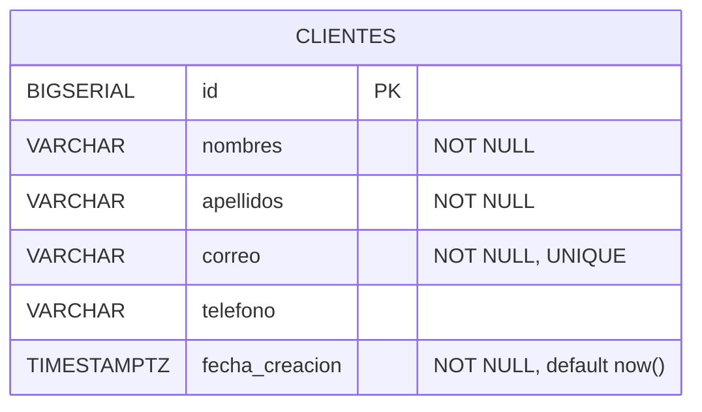

La tabla se crea con una migración Flyway versionada (`V1__crear_tabla_clientes.sql`).

### 8.2 Contrato REST

| Método | Ruta | Cuerpo | Éxito | Errores |
|---|---|---|---|---|
| POST | `/clientes` | `ClienteRequest` | `201` + `Location` | 400, 409 |
| GET | `/clientes` | — | `200` lista | — |
| GET | `/clientes/{id}` | — | `200` | 404 |
| PUT | `/clientes/{id}` | `ClienteRequest` | `200` | 400, 404, 409 |
| DELETE | `/clientes/{id}` | — | `204` | 404 |

> Todos los endpoints excepto `POST /auth/login` y `GET /actuator/health` exigen `Authorization: Bearer <token>` y responden **401** sin él. Detrás de Nginx la API se consume con el prefijo `/api` (por ejemplo `POST /api/clientes`); directo al microservicio no lleva prefijo.

**ClienteRequest**

```json
{
  "nombres": "Ana María",
  "apellidos": "Pérez Loor",
  "correo": "ana.perez@example.com",
  "telefono": "0991234567"
}
```

**ClienteResponse**

```json
{
  "id": 1,
  "nombres": "Ana María",
  "apellidos": "Pérez Loor",
  "correo": "ana.perez@example.com",
  "telefono": "0991234567",
  "fechaCreacion": "2026-10-05T15:30:00Z"
}
```

**Error (ProblemDetail)**

```json
{
  "type": "about:blank",
  "title": "Correo duplicado",
  "status": 409,
  "detail": "Ya existe un cliente con el correo ana.perez@example.com",
  "instance": "/clientes"
}
```

---

## 9. Seguridad (JWT)

*Épica 2. El CRUD queda completo y entregable sin ella.*

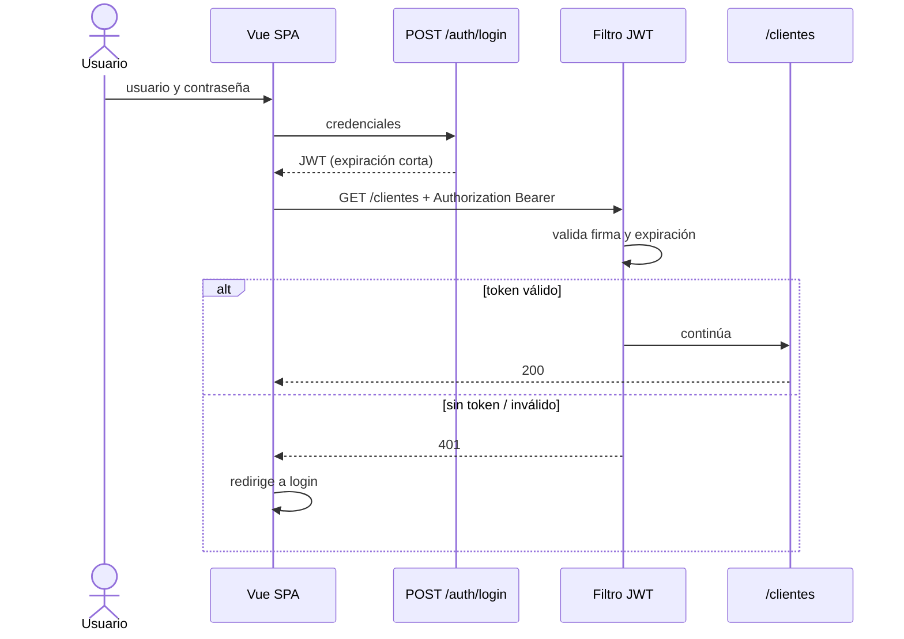

- **Autenticación:** `POST /auth/login` devuelve un JWT HS256.
- **Sin caso de uso de negocio:** el login es un mecanismo de seguridad de infraestructura (`infrastructure.security`: `AutenticadorAdministrador` y `JwtService`), no una regla de negocio; crear un puerto solo para comparar un hash sería sobreingeniería. Si el alcance crece (varios usuarios, roles), se promueve a un puerto `CredencialesPort`.
- **Usuario:** un único administrador definido por variables de entorno, con contraseña en BCrypt. Sin tabla de usuarios por ahora. Para evaluación local existe un usuario de demostración documentado en el [manual de primer uso](#primer-uso-levantar-la-aplicación-y-entrar) (§2.5); no es válido fuera de entornos locales.
- **Autorización:** todos los endpoints `/clientes/**` requieren token válido.
- **CORS:** en producción no hace falta, porque Nginx sirve el frontend y la API bajo el mismo origen. En desarrollo local se permite el origen de Vite.
- **HTTPS:** requisito de despliegue. Esta versión sirve HTTP en el puerto 8080; el TLS (y la cabecera HSTS) se termina en un balanceador o proxy delante, o se añade a Nginx con un certificado. No está implementado en el repo.
- **Secretos:** nunca en el repositorio; el repo solo incluye `.env.example`.

---

## 10. Dockerización y despliegue

### 10.1 Topología

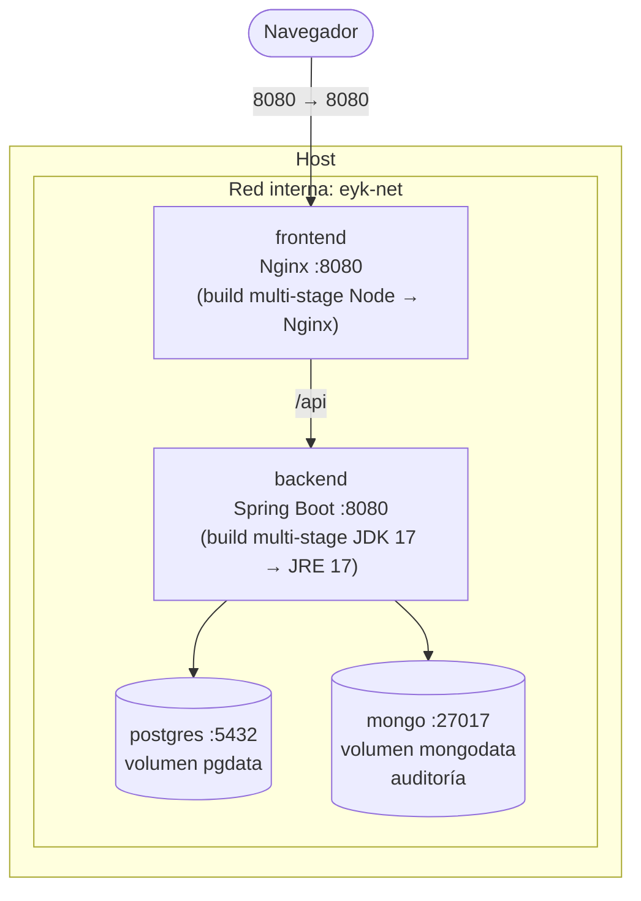

Solo Nginx publica un puerto al host. Backend y bases de datos son accesibles únicamente dentro de la red del Compose.

### 10.2 Servicios

| Servicio | Imagen | Notas |
|---|---|---|
| `postgres` | `postgres:16.15-alpine` | Volumen persistente, `healthcheck` con `pg_isready` |
| `ms-cliente-gestion` | Build propio (multi-stage) | Usuario no root, `depends_on: postgres (service_healthy)`, `healthcheck` en actuator |
| `ms-cliente-presentacion` | Build propio (Node → Nginx) | Sirve la SPA y hace reverse proxy `/api` → `ms-cliente-gestion` |
| `mongo` | Build propio sobre `mongo:7.0.43` (`infra/mongo/Dockerfile`) | Volumen persistente, `healthcheck`; el backend lo usa para auditoría (Épica 3) |

### 10.3 Variables de entorno (`.env.example`)

| Variable | Ejemplo | Usada por |
|---|---|---|
| `POSTGRES_DB` | `clientes` | postgres, backend |
| `POSTGRES_USER` | `clientes_app` | postgres, backend |
| `POSTGRES_PASSWORD` | *(aleatoria, la genera `scripts/init-env.sh`)* | postgres, backend |
| `SPRING_R2DBC_URL` | `r2dbc:postgresql://postgres:5432/clientes` | backend |
| `SPRING_FLYWAY_URL` | `jdbc:postgresql://postgres:5432/clientes` | backend |
| `MONGO_USER` / `MONGO_PASSWORD` | `mongo_root` / *(aleatoria)* | mongo (usuario root; el backend no lo usa) |
| `MONGO_APP_USER` / `MONGO_APP_PASSWORD` | `auditoria_app` / *(aleatoria)* | mongo y backend (permiso `readWrite` solo sobre `auditoria`) |
| `SPRING_DATA_MONGODB_URI` | `mongodb://<usuario>:<clave>@mongo:27017/auditoria?authSource=auditoria&serverSelectionTimeoutMS=2000` | backend (la arma el Compose) |
| `LOG_LEVEL` | `INFO` | backend |
| `JWT_SECRET` | *(mínimo 32 caracteres)* | backend |
| `JWT_EXPIRATION_MINUTES` | `15` | backend |
| `ADMIN_USER` / `ADMIN_PASSWORD_HASH` | `admin` / *(hash BCrypt)* | backend |
| `AWS_ENDPOINT_URL` | `http://localstack:4566` | backend (solo perfil `aws`) |
| `AWS_REGION` / `AWS_ACCESS_KEY_ID` / `AWS_SECRET_ACCESS_KEY` | `us-east-1` / `test` / `test` | backend y LocalStack (credenciales ficticias) |

### 10.4 Configuración de Nginx

- Sirve los archivos estáticos de la SPA con `try_files` hacia `index.html` (rutas del router).
- `location /api/` hace `proxy_pass` hacia `http://ms-cliente-gestion:8080/`.
- Cabeceras de seguridad básicas y compresión gzip.
- HTTPS: no incluido en esta versión (ver sección de seguridad).

### 10.5 Simulación de AWS en local (LocalStack)

El enunciado lista AWS en el stack. En vez de usar una cuenta real, se emula localmente con **LocalStack**, que expone la API de AWS en `http://localhost:4566`. Docker Compose sigue siendo la forma principal de levantar la aplicación; LocalStack es un servicio más, activable con el perfil `aws`.

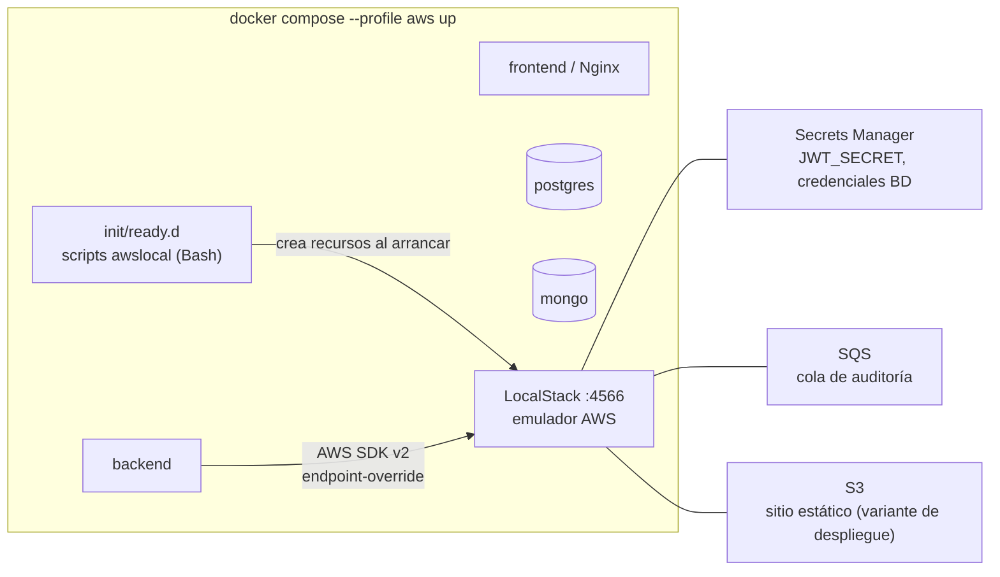

| Servicio AWS | Uso en el proyecto | Adaptador (hexagonal) |
|---|---|---|
| **Secrets Manager** | El backend lee `JWT_SECRET` y credenciales de BD al arrancar, en vez de variables de entorno planas | Configuración en `infrastructure/config` |
| **SQS** | La auditoría se publica en una cola y un consumidor la guarda en MongoDB, desacoplando la escritura | `AuditoriaSqsPublisher` (implementa `AuditoriaPort`) |
| **S3** | Variante de despliegue del frontend: `aws s3 sync dist/` a un bucket con hosting estático | Script de despliegue, no es código de la app |

**Estado actual (verificado)**

| Pieza | Estado |
|---|---|
| Servicio `localstack` (4.4.0, sin token) en el Compose, perfil `aws` | Hecho y probado |
| Aprovisionamiento automático: bucket S3, cola SQS `auditoria-clientes`, secreto en Secrets Manager (`infra/localstack/init/ready.d/`) | Hecho y probado |
| Despliegue de la SPA a S3 simulado (`scripts/aws-local-deploy-frontend.sh`) | Hecho y probado: el sitio se sirve en `http://localhost:4566/eykcorp-clientes-web/index.html` |
| Backend leyendo el secreto desde Secrets Manager | Opcional: hoy los secretos llegan por variables de entorno |
| Auditoría por SQS | Opcional: hoy la auditoría va directo a MongoDB |

Cómo usarlo:

```bash
docker compose --profile aws up -d localstack      # arranca el AWS simulado y crea los recursos
./scripts/aws-local-deploy-frontend.sh             # compila la SPA y la sube al bucket S3 simulado
docker compose --profile aws down                  # lo apaga
```

- **El dominio no cambia:** AWS entra solo como adaptadores de salida. En producción real basta con quitar `AWS_ENDPOINT_URL`.
- **Perfil `aws` de Spring:** activa los adaptadores de AWS. Sin él, la auditoría escribe directo a MongoDB y los secretos vienen del `.env`.
- **Aprovisionamiento:** scripts Bash con `awslocal` en `localstack/init/ready.d/`, que crean el secreto, la cola y el bucket al iniciar el contenedor.
- **Limitación conocida:** RDS y ECS/Fargate no se emulan en la versión gratuita estable. PostgreSQL y los contenedores siguen corriendo en Docker Compose.
- **Versión y licencia:** desde el 23 de marzo de 2026 la imagen `localstack/localstack:latest` exige un token de cuenta. Para que cualquier evaluador pueda ejecutar el repo sin registrarse, se **fija la versión sin token** (`localstack/localstack:4.4.0`). Ver ADR-014.
- **CI:** el workflow de GitHub Actions tiene hoy tres jobs (backend, frontend y construcción de las imágenes). Probar LocalStack en CI queda pendiente junto con los adaptadores de AWS.

---

## 11. Estrategia de pruebas

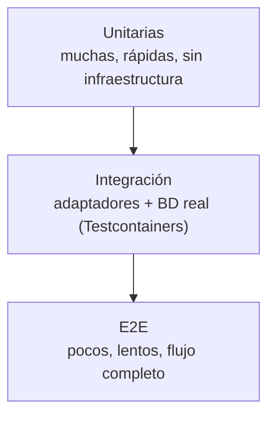

| Nivel | Backend | Frontend |
|---|---|---|
| **Unitario** | Dominio (JUnit 5); `ClienteService` con `StepVerifier` y dobles en memoria | Vitest + Vue Test Utils: componentes, composables, `clienteService` con `fetch` simulado |
| **Slice** | `@WebFluxTest` + `WebTestClient`: controller y `GlobalExceptionHandler` | Vista montada con MSW como API simulada |
| **Integración** | Testcontainers + PostgreSQL y MongoDB: adaptadores R2DBC y Mongo, migraciones Flyway. Test de **contrato compartido** que corre contra `InMemoryClienteRepository` y contra el adaptador real | — |
| **Arquitectura** | ArchUnit: el dominio no depende de Spring ni de infraestructura | — |
| **E2E** | `@SpringBootTest` con puerto real + Testcontainers: CRUD completo, 400, 404, 409, 401 | Prueba de humo del sistema completo a través de Nginx (`scripts/smoke-test.sh`); sin Playwright en esta versión |

Regla de trabajo: **TDD**. Cada historia empieza con un test que falla (RED), se implementa lo mínimo (GREEN) y se refactoriza. El historial de Git lo refleja con commits separados.

---

## 12. Plan de entrega: épicas e historias

### Estado de la entrega

**Todo lo que pide la prueba está hecho y funcionando**: el CRUD de clientes (backend y frontend), las validaciones, el manejo global de errores, los logs, las variables de entorno, los Dockerfile y el Docker Compose, y el historial de Git por ramas. Además se añadió seguridad con JWT, auditoría en MongoDB, el contrato OpenAPI con Swagger y pruebas automáticas en el CI.

| Épica | Estado | Qué incluye |
|---|---|---|
| E0 Fundación | Hecha | Monorepo, Compose y CI |
| E1 CRUD de clientes | Hecha | Backend hexagonal reactivo (PostgreSQL) y frontend Vue |
| E2 Seguridad JWT | Hecha | Token de 15 min, `iss` y `aud` validados, login sin enumeración de usuarios |
| E3 Auditoría en MongoDB | Hecha | Cada alta, cambio o baja queda registrada (documentos `CREADO`, `ACTUALIZADO`, `ELIMINADO`) |
| E4 AWS | Hecha **en local con LocalStack** | S3, SQS y Secrets Manager simulados; la SPA se despliega a un bucket S3 simulado |
| E5 Entrega | Hecha | READMEs, revisiones de calidad y seguridad, y contrato OpenAPI |

**Sobre AWS:** una cuenta real de AWS exige tarjeta de crédito, así que no se contrata. En su lugar el entorno queda listo para simularse en local con [LocalStack](https://www.localstack.cloud/), que ofrece los mismos servicios sin costo y sin cuenta. Quien quiera probarlo puede hacerlo con `docker compose --profile aws up -d localstack`, que crea el bucket S3, la cola SQS y el secreto, y con `scripts/aws-local-deploy-frontend.sh`, que sube la aplicación al bucket simulado. La aplicación funciona igual sin LocalStack: sus secretos llegan por variables de entorno y la auditoría va directo a MongoDB.

**Verificación (v0.2.0):** backend 254 tests (JUnit, ArchUnit, Testcontainers con PostgreSQL y MongoDB reales, conformidad con el contrato OpenAPI; ~95 % de líneas), frontend 106 tests (Vitest y MSW; 100 % de líneas), CI en verde y `scripts/smoke-test.sh` contra el sistema completo levantado con `docker compose up` (14 comprobaciones: SPA, proxy, 401, login, CRUD, 400, 404 y 409).

**Contrato de la API:** el YAML OpenAPI es la fuente de verdad (`ms-cliente-gestion/src/main/resources/static/openapi/ms-cliente-gestion.yaml`) y Swagger UI queda en `http://localhost:8080/api/swagger-ui.html`.

**Mejoras para una siguiente versión**

- HTTPS: la aplicación sirve HTTP en el puerto 8080; el TLS se terminaría en un balanceador o en Nginx con un certificado.
- Pruebas de navegador (Playwright): hoy la interfaz se prueba con Vitest y MSW, y el sistema completo con el script de humo.
- Análisis automático de vulnerabilidades de Gradle y SonarQube en el CI (Dependabot ya está activo).
- Límite de intentos de login también en la aplicación (hoy lo aplica Nginx: 5 por minuto por IP).

Las excepciones deliberadas a las reglas de diseño (Reactor en `application`, auditoría sin transacción compartida con PostgreSQL y login sin caso de uso) están explicadas en [`docs/arquitectura/decisiones.md`](docs/arquitectura/decisiones.md).

### Plan original

| Épica | Historias | Resultado |
|---|---|---|
| **E0 · Fundación** | Monorepo y `.gitignore`; Compose base con Postgres; CI vacío que compila | Repo ejecutable |
| **E1 · CRUD Clientes** | Dominio y puertos; casos de uso; adaptador R2DBC + Flyway; controller, DTOs y errores; frontend (lista, formulario, eliminar, errores, carga); Nginx + Dockerfiles; tests unitarios, de integración y e2e | Entregable mínimo completo |
| **E2 · Seguridad JWT** | Login y filtro JWT en backend; login y guard en frontend; tests 401/403 | API protegida |
| **E3 · Auditoría MongoDB** | `AuditoriaPort` + adaptador Mongo reactivo; servicio `mongo` en Compose; tests de integración y e2e | Segunda persistencia |
| **E4 · AWS local (LocalStack)** | Servicio LocalStack en Compose (perfil `aws`); scripts de init; lectura de secretos desde Secrets Manager; `AuditoriaSqsPublisher` + consumidor; script de despliegue del frontend a S3; tests de integración contra LocalStack | Stack AWS simulado |
| **E5 · Entrega** | READMEs de backend y frontend; ADRs; revisión de seguridad y de código; limpieza del historial | Listo para presentar |

**Trazabilidad requisito → épica → prueba:**

| Requisito | Historia | Prueba |
|---|---|---|
| CRUD de clientes | E1 | e2e backend y frontend |
| DTOs y validaciones | E1 | `@WebFluxTest` |
| Manejo global de excepciones | E1 | `@WebFluxTest` |
| Logs básicos | E1 | revisión de código |
| Variables de entorno | E0/E1 | `docker compose config` |
| Dockerfile / Compose funcional | E0/E1 | job `imagenes-docker` en CI y `scripts/smoke-test.sh` |
| Estados de carga y error (frontend) | E1 | Vitest + MSW |

---

## 13. Estructura del monorepo

```
ec-eykcorp/
├── README.md                         este documento
├── docker-compose.yml                sistema completo (+ docker-compose.dev.yml para desarrollo)
├── .env.example                      plantilla; el .env real lo genera scripts/init-env.sh (no se versiona)
├── .gitignore
├── .github/
│   ├── workflows/ci.yml              CI: backend, frontend e imágenes Docker
│   └── dependabot.yml
├── docs/
│   ├── requerimientos/               requisitos de la prueba y trazabilidad
│   └── arquitectura/                 arquitectura final y decisiones
├── infra/
│   ├── mongo/                        imagen de MongoDB con el usuario de la aplicación
│   └── localstack/                   aprovisionamiento del AWS simulado
├── scripts/                          init-env.sh, smoke-test.sh, aws-local-deploy-frontend.sh
├── ms-cliente-gestion/               backend (Spring Boot WebFlux), README propio
└── ms-cliente-presentacion/          frontend (Vue 3 + Nginx), README propio
```

---

### 13.1 Nombres y versionado de componentes

| Rol | Patrón | Componente | Imagen Docker |
|---|---|---|---|
| Backend (lógica y datos) | `ms-<dominio>-<subdominio>` | `ms-cliente-gestion` | `eykcorp/ms-cliente-gestion:0.1.0` |
| Frontend (interfaz web) | `ms-<dominio>-<subdominio>` | `ms-cliente-presentacion` | `eykcorp/ms-cliente-presentacion:0.1.0` |

Ambos son microservicios del dominio `cliente`; el subdominio indica qué hace cada uno (*gestión* o *presentación*).

- **Versionado semántico** (`MAJOR.MINOR.PATCH`) independiente por componente: `version` en `build.gradle.kts` y en `package.json`; la misma versión etiqueta la imagen Docker. Arrancan en `0.1.0` y pasan a `1.0.0` al cerrar la Épica 5.
- **Versiones fijadas:** Spring Boot, plugins de Gradle, dependencias y imágenes base se declaran con versión exacta (nada de `latest`), para que el build sea reproducible.
- Los servicios de Compose usan el nombre del componente (`ms-cliente-gestion`, `ms-cliente-presentacion`); `postgres`, `mongo` y `localstack` conservan el de su tecnología.
- El paquete Java raíz sigue siendo `com.eykcorp.clientes`.

---

### 13.2 Estrategia de ramas y commits

`main` es la rama estable: no se trabaja directo en ella. Cada entrega nace en una rama con prefijo, se prueba y se fusiona con `--no-ff` para que el historial muestre de dónde salió cada cambio.

| Prefijo | Uso | Ramas |
|---|---|---|
| `feature/` | Funcionalidad nueva | `fundacion-monorepo`, `docker-compose-nginx`, `frontend-vue-crud-login`, `hexagonal-dominio`, `hexagonal-servicios`, `persistencia-postgres`, `api-rest-clientes`, `auditoria-mongodb`, `seguridad-jwt`, `endurecimiento-infra`, `aws-localstack`, `backend-correcciones-fase4`, `credenciales-demo-y-manual`, `lombok-y-logs`, `openapi-contract-first` |
| `fix/` | Corrección de errores | `frontend-telefono-accesibilidad`, `docker-multiplataforma`, `precision-fecha-creacion` |
| `refactor/` | Cambio interno sin alterar comportamiento | `lombok-infraestructura`, `renombrar-microservicios`, `organizacion-paquetes-web`, `puertos-solo-interfaces` |
| `docs/` | Documentación | `readme-microservicios`, `estado-final-readme`, `estrategia-de-ramas`, `readme-alineado-con-el-codigo` |

- **Flujo:** rama → commits → *push* de la rama → `merge --no-ff` a `main` (`Merge <rama> into main: <descripción>`). Las ramas se conservan para poder ver cada entrega.
- **Commits:** [Conventional Commits](https://www.conventionalcommits.org/) en español, uno por funcionalidad terminada y con sus pruebas incluidas (`feat(dominio)`, `feat(servicio)`, `feat(persistencia)`, `feat(web)`, `fix(frontend)`...).
- **Nota sobre el historial:** las primeras entregas (hasta `feature/fundacion-monorepo`) se hicieron sobre una rama de trabajo y entraron a `main` sin fusión explícita; las ramas `feature/*` de la etapa siguiente se crearon al final de cada entrega sobre sus commits reales. Desde ahí, cada cambio nace en su propia rama.

---

## 14. Cómo ejecutar

Cada microservicio tiene su propio README con requisitos, variables de entorno, arquitectura y pruebas:

- [`ms-cliente-gestion`](ms-cliente-gestion/README.md): backend (Spring Boot WebFlux).
- [`ms-cliente-presentacion`](ms-cliente-presentacion/README.md): frontend (Vue 3 + Nginx).

**Todo el sistema con un comando** (necesita Docker y Docker Compose v2):

```bash
cp .env.example .env            # completa los secretos; ver comentarios del archivo
docker compose up --build       # postgres + mongo + backend + frontend
# Aplicación: http://localhost:8080   (único puerto publicado)
```

**Pruebas**

```bash
cd ms-cliente-gestion      && ./gradlew check     # unitarias, integración, e2e y ArchUnit (requiere Docker)
cd ms-cliente-presentacion && npm ci && npm test  # Vitest
./scripts/smoke-test.sh                            # sistema completo (con docker compose up y ADMIN_USER/ADMIN_PASSWORD)
```

---

## 15. Decisiones de arquitectura (ADR)

| # | Decisión | Motivo | Alternativa descartada |
|---|---|---|---|
| 001 | Hexagonal liviana, un agregado | Cumple "por capas" y aísla el dominio sin sobreingeniería | CQRS / event sourcing: excesivo para un CRUD |
| 002 | WebFlux + R2DBC | Reactividad real de punta a punta | JPA/JDBC: bloquearía el event loop |
| 003 | Flyway con JDBC solo al arrancar | R2DBC no migra esquemas | Scripts manuales: no reproducible |
| 004 | Vue 3 + Vite | El enunciado pide una SPA | Astro: orientado a contenido estático |
| 005 | Nginx como reverse proxy | Mismo origen, sin CORS en producción | Exponer backend directo |
| 006 | Borrado físico | El enunciado dice "eliminar" | Borrado lógico (se puede añadir luego) |
| 007 | JWT con usuario único por entorno | Seguridad básica sin gestión de usuarios | Tabla de usuarios y roles: fuera de alcance |
| 008 | MongoDB en Docker solo para auditoría | Único caso donde un documento aporta valor real; demuestra un segundo adaptador de salida | Usarlo para clientes: sin justificación |
| 009 | Documentación y dominio en español; infraestructura en inglés | El contrato define los campos en español | — |
| 010 | `reactor-core` (`reactor.core`, `reactor.util.function/context/retry`) permitido únicamente en `application`; el dominio queda sin librerías externas | Los puertos reactivos devuelven `Mono`/`Flux`, así que la capa `application` necesita Reactor; se declara como excepción explícita (EXC-1) | Puertos síncronos con adaptadores que convierten: pierde el flujo reactivo |
| 011 | Auditoría de mejor esfuerzo | Un fallo de Mongo no debe impedir operar clientes | Auditoría transaccional entre Postgres y Mongo: complejidad excesiva |
| 014 | LocalStack fijado en 4.4.0 (sin token) para simular AWS | Cualquiera puede clonar y ejecutar sin cuenta; `latest` exige token desde marzo 2026 | `latest` con token: obliga a cada evaluador a registrarse |
| 015 | Servicios AWS acotados a Secrets Manager, SQS y S3 | Tienen uso real en la app y están disponibles sin licencia; RDS/ECS no | Emular RDS/ECS: requiere plan de pago |
| 016 | Nombres `ms-<dominio>-<subdominio>` para backend y frontend (`ms-cliente-gestion`, `ms-cliente-presentacion`) y SemVer por componente | Un único estándar profesional que identifica dominio y propósito; el subdominio evita nombres técnicos como `crud` | Nombres genéricos `backend`/`frontend` o con `crud` |
| 013 | Gradle (Kotlin DSL) con toolchain Java 17 | Compila siempre con 17 aunque el JDK local sea otro; builds incrementales | Maven: válido, pero sin toolchain tan directo |
| 012 | Adaptador en memoria solo para tests | Pruebas rápidas y test de contrato compartido | H2 con R2DBC: no aporta frente a Testcontainers |
