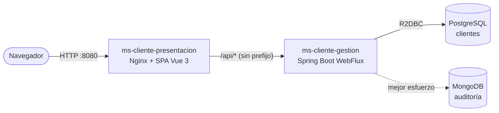
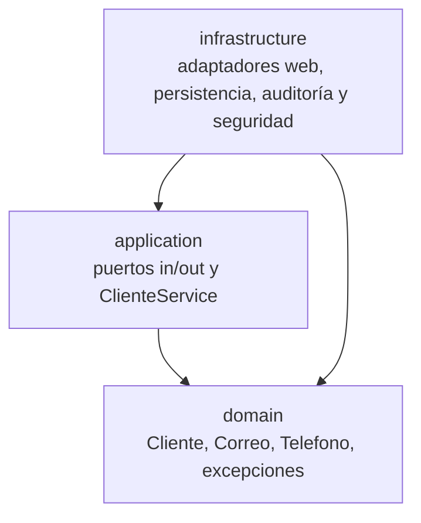

# Arquitectura

Resumen de cómo está construido el sistema y por qué. Los diagramas completos (secuencia, clases, estados, actividad, entidad-relación) viven en el [README principal](../../README.md) y no se duplican aquí; este documento los enlaza y añade el contexto de diseño.

## 1. Visión general

El sistema es una plataforma de gestión de clientes con dos microservicios y dos bases de datos:

- `ms-cliente-gestion`: backend reactivo (Spring Boot WebFlux) con arquitectura hexagonal.
- `ms-cliente-presentacion`: SPA de Vue 3 servida por Nginx, que además hace de proxy hacia la API.
- PostgreSQL guarda los clientes. MongoDB guarda la auditoría.



Contexto completo con Docker Compose: [README principal, 4.1](../../README.md#41-contexto-del-sistema) y [10.1](../../README.md#101-topología). La conexión HTTPS no está implementada en el repositorio (ver [requerimientos, 3.5](../requerimientos/requerimientos-practica.md#35-pendientes-y-deuda-declarada)).

## 2. Hexagonal reactiva con DDD ligero

- **Hexagonal (puertos y adaptadores):** el núcleo (dominio y aplicación) define puertos; la infraestructura los implementa con adaptadores. Se cambia una tecnología (por ejemplo, el almacén de auditoría) sin tocar la lógica de negocio.
- **Reactiva de punta a punta:** los puertos devuelven `Mono` y `Flux`. Ninguna llamada bloquea el event loop, y una regla de ArchUnit lo vigila ([ADR-002](adr/adr-002-webflux-r2dbc.md)).
- **DDD ligero:** un único contexto delimitado (*Gestión de Clientes*), un agregado raíz (`Cliente`) y dos value objects (`Correo`, `Telefono`). No se modelan eventos de dominio, sagas ni CQRS, por proporcionalidad ([ADR-001](adr/adr-001-hexagonal-liviana.md)). Lenguaje ubicuo y elementos tácticos en el [README principal, 5.0](../../README.md#50-descomposición-ddd).

Mapa hexagonal detallado: [README principal, 5.2](../../README.md#52-mapa-hexagonal).

## 3. Capas y regla de dependencia

La dependencia siempre apunta hacia adentro.



| Capa | Puede depender de | Verificado por |
|---|---|---|
| `domain` | Solo de `java..` y de sí misma | `el_dominio_es_java_puro` |
| `application` | `java..`, `domain`, `reactor.core..`, `reactor.util.function`, `reactor.util.context`, `reactor.util.retry` y la anotación `@Service` | `la_aplicacion_no_depende_de_adaptadores_ni_frameworks` |
| `infrastructure` | Cualquiera de las anteriores y los frameworks | Reglas entre adaptadores y seguridad |

Reglas adicionales de `ArchitectureTest` (clase de `ms-cliente-gestion/src/test/java/com/eykcorp/clientes/`):

- Los adaptadores (`adapter.in.web`, `adapter.out.persistence`, `adapter.out.audit`) no dependen entre sí.
- Sin ciclos entre módulos.
- Sin llamadas bloqueantes de Reactor en código de producción.
- La seguridad (`infrastructure.security`) no depende de los adaptadores.
- Los puertos declaran como máximo siete métodos.
- Los modelos de persistencia y auditoría no reutilizan nombres de clases del dominio.

Cada regla tiene un **canario** en `ReglasArquitecturaTest`: una clase de prueba bajo `com.eykcorp.fixture` que la viola a propósito y debe ser detectada, para que una regla no pueda quedar vacía sin que nadie lo note. Las excepciones aplicadas a estas reglas están en [excepciones.md](excepciones.md).

## 4. Estructura de paquetes actual

Ruta base: `ms-cliente-gestion/src/main/java/com/eykcorp/clientes/`.

```
domain/cliente/
    Cliente, Correo, Telefono
    DomainException, ValorInvalidoException,
    ClienteNoEncontradoException, CorreoDuplicadoException
application/
    port/in/    CrearClienteUseCase, ListarClientesUseCase, ObtenerClienteUseCase,
                ActualizarClienteUseCase, EliminarClienteUseCase, DatosCliente
    port/out/   ClienteRepositoryPort, AuditoriaPort, AccionAuditoria
    service/    ClienteService
infrastructure/
    adapter/in/web/        ClienteController, AuthController, ClienteRequest, ClienteResponse,
                           LoginRequest, LoginResponse, ClienteWebMapper,
                           GlobalExceptionHandler, CredencialesInvalidasException
    adapter/out/persistence/  ClientePersistenceAdapter, ClienteEntity,
                              ClienteR2dbcRepository, ClienteEntityMapper
    adapter/out/audit/        AuditoriaMongoPublisher, AuditoriaDocument, AuditoriaDocumentMapper
    security/              SecurityConfig, JwtService, JwtProperties, AdminProperties,
                           AutenticadorAdministrador, ProblemaSeguridadHandler, TokenEmitido
```

Nota: las clases de la capa web, de persistencia y de auditoría están directamente en su paquete, sin los subpaquetes `dto`, `mapper`, `error` ni `config` que muestra el árbol del README principal (sección 5.3). Es una diferencia de presentación del README, no de comportamiento.

Equivalencia con una arquitectura "por capas" clásica:

| Capa clásica | Paquete |
|---|---|
| Controller | `infrastructure.adapter.in.web` (`ClienteController`) |
| Service | `application.service` (`ClienteService`) |
| Repository | `infrastructure.adapter.out.persistence` (`ClientePersistenceAdapter`) |
| Modelo | `domain.cliente` |
| DTO | `ClienteRequest` y `ClienteResponse` en `infrastructure.adapter.in.web` |

## 5. Patrones aplicados

Tabla completa en el [README principal, sección 7](../../README.md#7-patrones-de-diseño). Los más relevantes en el código:

| Patrón | Dónde |
|---|---|
| Puertos y adaptadores | `application/port` y `infrastructure/adapter` |
| Repository | `ClienteRepositoryPort` y `ClientePersistenceAdapter` |
| Caso de uso por interfaz | `CrearClienteUseCase` y compañeras, implementadas por `ClienteService` |
| Value Object | `Correo` (normaliza a minúsculas) y `Telefono` (7 a 15 dígitos) |
| Fábrica estática | `Cliente.crear(...)` |
| DTO y mapper | `ClienteRequest`, `ClienteResponse`, `ClienteWebMapper`, `ClienteEntityMapper` |
| Contrato compartido de puertos | `ClienteRepositoryPortContract` y `AuditoriaPortContract` (fake y adaptador real pasan la misma batería) |
| Inyección por constructor | `ClienteService` y los adaptadores |

## 6. Frontend por capas

SPA de Vue 3 (Composition API) en `ms-cliente-presentacion/src`:

| Capa | Archivos | Responsabilidad |
|---|---|---|
| Presentación | `components/` (`ClienteTable`, `ClienteForm`, `ConfirmDialog`, `LoadingSpinner`, `ErrorAlert`) | Componentes sin lógica de negocio ni llamadas HTTP |
| Contenedores | `pages/` (`ClientesPage`, `LoginPage`) | Orquestan componentes y estado |
| Estado y lógica | `domain/` (`useClientes`, `useAuth`) | Composables con carga, error y sesión |
| Acceso a datos | `services/` (`clienteService`, `authService`, `httpClient`) | Único punto HTTP; añade el token y trata el 401 |
| Arranque | `app/` (`buildApp`, `router`, `keys`, `main`) | Composición de dependencias y guard de autenticación |

Diagrama: [README principal, 6.2](../../README.md#62-capas-del-frontend). El frontend no es hexagonal, pero conserva la misma idea: los componentes dependen de composables y estos de un servicio, nunca al revés.

## 7. Más documentación

- [Excepciones a las reglas de arquitectura](excepciones.md)
- [Registro de decisiones (ADR)](adr/README.md)
- [Estrategia de pruebas](../pruebas/estrategia.md)
