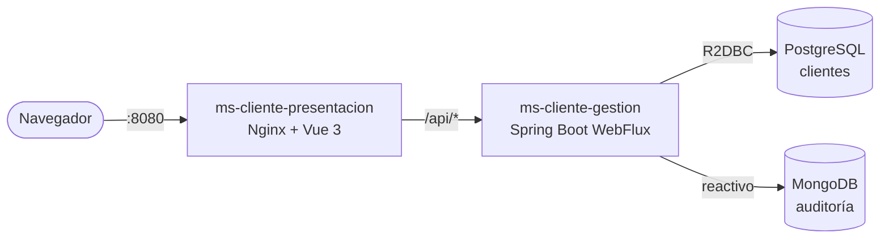

# Arquitectura final

## Visión general

Dos microservicios del dominio `cliente`, desplegados con Docker Compose:

- **`ms-cliente-gestion`** (backend): Spring Boot 3 WebFlux, arquitectura **hexagonal** y reactiva de punta a punta (R2DBC para PostgreSQL y MongoDB reactivo).
- **`ms-cliente-presentacion`** (frontend): SPA en Vue 3 servida por Nginx, que además hace de proxy hacia el backend bajo `/api`.



Solo Nginx publica un puerto al exterior (8080). Las bases de datos y el backend viven en la red interna de Compose.

## Backend: hexagonal

La dependencia apunta siempre hacia el dominio: `infrastructure → application → domain`. Las pruebas de ArchUnit lo hacen cumplir, con casos canario que demuestran que cada regla detecta su violación.

```
com.eykcorp.clientes
├── domain/cliente            Cliente, Correo, Telefono, AccionAuditoria y excepciones (Java puro)
├── application
│   ├── command               DatosCliente
│   ├── port/in               casos de uso (solo interfaces)
│   ├── port/out              ClienteRepositoryPort, AuditoriaPort (solo interfaces)
│   └── service               ClienteService
└── infrastructure
    ├── adapter/in/web        controller, dto/request, dto/response, mapper, exception
    ├── adapter/out/persistence  adaptador R2DBC + migración Flyway
    ├── adapter/out/audit        adaptador MongoDB
    └── security              JWT, SecurityConfig, login del administrador
```

Equivalencia con una arquitectura clásica por capas: controller (`adapter.in.web.controller`), service (`application.service`), repository (`adapter.out.persistence`), modelo (`domain.cliente`), DTO (`adapter.in.web.dto`).

## Contrato y seguridad

- **API-first:** el contrato OpenAPI (`src/main/resources/static/openapi/ms-cliente-gestion.yaml`) es la fuente de verdad; Swagger UI lo muestra en `/api/swagger-ui.html`. Pruebas comprueban que el YAML es válido, que coincide con los endpoints implementados y que las respuestas reales lo cumplen.
- **Autenticación JWT** (HS256, 15 minutos por defecto, `iss` y `aud` validados). El único usuario es un administrador definido por variables de entorno, con contraseña BCrypt. Todo es `denyAll` salvo el login, la salud y la documentación.
- **Errores** en formato `ProblemDetail` (RFC 7807), con un único punto de traducción.

## Datos

- **PostgreSQL** guarda los clientes; el correo es único por restricción en la base (`uk_clientes_correo`). Flyway migra el esquema al arrancar.
- **MongoDB** guarda la auditoría (acción, id de cliente y fecha, sin datos personales). Es de mejor esfuerzo: si Mongo falla, la operación sobre el cliente no se revierte.

## Frontend

Capas de dentro hacia fuera: `domain/` (composables con la lógica: `useClientes`, `useAuth`), `services/` (único punto que habla con la API), `components/` (presentacionales, sin red) y `pages/` (contenedores). El token se guarda en `sessionStorage`; no se usa `v-html`.

## Patrones principales

Puertos y adaptadores, repositorio, DTO con mapper manual, value objects (`Correo`, `Telefono`), inyección por constructor, cadena de filtros de seguridad, y en el frontend composables y separación contenedor/presentacional.

## Despliegue

`docker compose up` levanta PostgreSQL, MongoDB, el backend y el frontend con comprobaciones de salud y dependencias entre ellos. Cada microservicio tiene su Dockerfile en dos etapas (compila y ejecuta con una imagen mínima, sin usuario root). Con el perfil `aws` se añade LocalStack para simular S3, SQS y Secrets Manager.

Las decisiones y excepciones de diseño están en [decisiones.md](decisiones.md).
