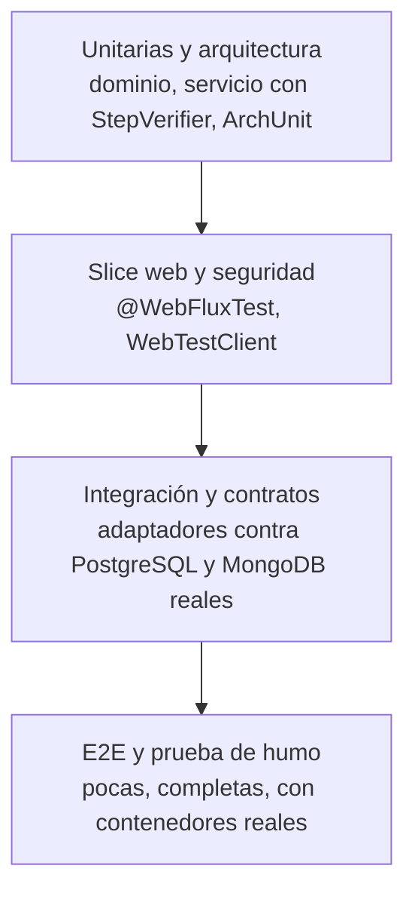

# Estrategia de pruebas

El proyecto sigue un enfoque **TDD**: cada historia empieza con una prueba que falla, se implementa lo mínimo para que pase y después se refactoriza. Las pruebas están pensadas en niveles: muchas rápidas y sin infraestructura en la base, pocas y completas en la cima.



Los números de la última verificación están en [resultados-v0.1.0.md](resultados-v0.1.0.md).

## 1. Backend (`ms-cliente-gestion`)

Las rutas de esta sección son relativas a `ms-cliente-gestion/src/test/java/com/eykcorp/clientes/`.

| Nivel | Qué verifica | Clases |
|---|---|---|
| Dominio (unitario) | Invariantes del agregado y de los value objects, sin framework | `domain/cliente/ClienteTest`, `CorreoTest`, `TelefonoTest` |
| Servicio de aplicación | Los cinco casos de uso con `StepVerifier`, sobre un repositorio en memoria y una auditoría falsa, con reloj fijo. Incluye auditoría que falla o es lenta, y que el repositorio fallando no audita | `application/service/ClienteServiceTest`; `ClienteServiceLoggingTest` (el `System.Logger` llega a SLF4J y sin datos personales) |
| Contratos de puertos | Una misma batería se ejecuta contra el doble y contra el adaptador real. Si divergen, falla | `application/port/out/ClienteRepositoryPortContract` (ejecutado por `InMemoryClienteRepositoryTest` y por `ClientePersistenceAdapterIT`); `AuditoriaPortContract` (ejecutado por `FakeAuditoriaPortTest` y por `AuditoriaMongoPublisherIT`) |
| Integración de persistencia | Adaptador R2DBC y migración Flyway contra PostgreSQL real (Testcontainers); restricción única de correo | `infrastructure/adapter/out/persistence/ClientePersistenceAdapterIT`, `ClienteEntityMapperTest` |
| Integración de auditoría | Adaptador de MongoDB contra MongoDB real; el documento no contiene datos personales | `infrastructure/adapter/out/audit/AuditoriaMongoPublisherIT`, `AuditoriaMongoPublisherTest`, `AuditoriaDocumentMapperTest` |
| Web (slice) | Controlador, DTO, validación y traducción de errores a `ProblemDetail` con `@WebFluxTest` y `WebTestClient` | `infrastructure/adapter/in/web/ClienteControllerTest`, `GlobalExceptionHandlerTest`, `ClienteWebMapperTest` |
| Seguridad | Token ausente, basura, expirado, de otra clave, de otro emisor o sin audiencia; login correcto e incorrecto; rutas no declaradas | `infrastructure/adapter/in/web/SeguridadWebTest`; `infrastructure/security/JwtServiceTest`, `JwtPropertiesTest`, `AutenticadorAdministradorTest` |
| Arquitectura | Reglas de dependencia, ausencia de bloqueos, adaptadores independientes y puertos pequeños | `ArchitectureTest` (8 reglas) |
| Canarios de arquitectura | Cada regla se prueba contra clases de ejemplo que la violan a propósito (y otras permitidas) bajo `com.eykcorp.fixture`, para asegurar que no se queda vacía | `ReglasArquitecturaTest`, con `ReglasArquitectura` y los fixtures `violacion/*` y `permitido/*` |
| Extremo a extremo | Aplicación completa con puerto real y contenedores reales: flujo CRUD, 400, 401, 404, 409, altas concurrentes con el mismo correo (un `201` y el resto `409`, nunca `500`) | `ClienteE2ETest`, `ClientesApplicationTests` (salud y `actuator/env` protegido) |
| Resiliencia | Con MongoDB caído, `POST /clientes` responde `201` dentro del tiempo límite y la salud sigue en `UP` | `ClienteMongoCaidoE2ETest` |

Los contenedores los arrancan `PostgresTestContainer` y `MongoTestContainer` (en `infrastructure/adapter/out/`). Las pruebas de integración y de extremo a extremo **requieren Docker**.

### Cobertura mínima exigida

`./gradlew check` ejecuta además `jacocoTestCoverageVerification`: mínimo de 80 % de líneas y 70 % de ramas (se excluye la clase de arranque `ClientesApplication`; el código generado por Lombok se ignora por `lombok.config`). El informe se genera en `ms-cliente-gestion/build/reports/jacoco/`.

## 2. Frontend (`ms-cliente-presentacion`)

Rutas relativas a `ms-cliente-presentacion/tests/unit/`. Se usa Vitest con jsdom, Vue Test Utils y MSW como API simulada.

| Nivel | Qué verifica | Archivos |
|---|---|---|
| Componentes | Cada componente presentacional por separado (props, eventos, accesibilidad) | `components/ClienteTable.test.js`, `ClienteForm.test.js`, `ConfirmDialog.test.js`, `ErrorAlert.test.js`, `LoadingSpinner.test.js` |
| Composables | Estado de carga, error y sesión | `domain/useClientes.test.js`, `useAuth.test.js` |
| Servicios | Cliente HTTP (cabecera `Authorization`, `ApiError`, 401, 204) y servicios de clientes y autenticación con `fetch` simulado | `services/httpClient.test.js`, `clienteService.test.js`, `authService.test.js` |
| Páginas | Vistas contenedoras con MSW | `pages/ClientesPage.test.js`, `LoginPage.test.js` |
| Integración de la aplicación | La aplicación completa montada (router, guard, token, redirección ante 401) contra MSW | `app/App.integration.test.js`, `router.test.js`, `keys.test.js`, `App.test.js` |

Además, el CI ejecuta `npm run lint` (ESLint), `npm run format:check` (Prettier) y `npm audit --omit=dev --audit-level=high`.

## 3. Sistema completo: prueba de humo

`scripts/smoke-test.sh` comprueba, mediante `curl`, el sistema ya levantado con Docker Compose a través de Nginx. Son 14 comprobaciones; la lista está en [resultados-v0.1.0.md](resultados-v0.1.0.md#prueba-de-humo). No sustituye a una prueba de navegador: valida la API, el proxy y la entrega de la SPA, no la interacción en pantalla.

## 4. Cómo ejecutarlas

Todos los comandos parten de la raíz del repositorio.

```bash
# Backend: unitarias, integración, e2e, ArchUnit y verificación de cobertura (requiere Docker)
cd ms-cliente-gestion && ./gradlew check

# Backend: solo una clase de prueba
cd ms-cliente-gestion && ./gradlew test --tests 'com.eykcorp.clientes.application.service.ClienteServiceTest'

# Frontend: pruebas
cd ms-cliente-presentacion && npm ci && npm test

# Frontend: pruebas con informe de cobertura, lint y formato (lo que ejecuta el CI)
cd ms-cliente-presentacion && npm run test:coverage && npm run lint && npm run format:check

# Sistema completo: levantar y ejecutar la prueba de humo
cp .env.example .env          # completar los secretos
docker compose up --build -d
ADMIN_USER=admin ADMIN_PASSWORD='<contraseña en claro cuyo hash BCrypt está en ADMIN_PASSWORD_HASH>' ./scripts/smoke-test.sh
```

`BASE_URL` es opcional en la prueba de humo (por defecto `http://localhost:8080`).

## 5. Integración continua

`.github/workflows/ci.yml` se dispara en `push` a `main` y a ramas `epic/**`, y en pull requests hacia `main`. Tiene tres jobs:

| Job | Qué ejecuta |
|---|---|
| `ms-cliente-gestion` | `./gradlew check` con Java 17 (pruebas, ArchUnit y umbrales de cobertura) |
| `ms-cliente-presentacion` | `npm ci`, `npm audit --omit=dev --audit-level=high`, lint, `format:check`, `test:coverage` y `build` |
| `imagenes-docker` | `docker compose build` de las imágenes de los dos microservicios |

El CI **no** ejecuta la prueba de humo ni levanta LocalStack.
