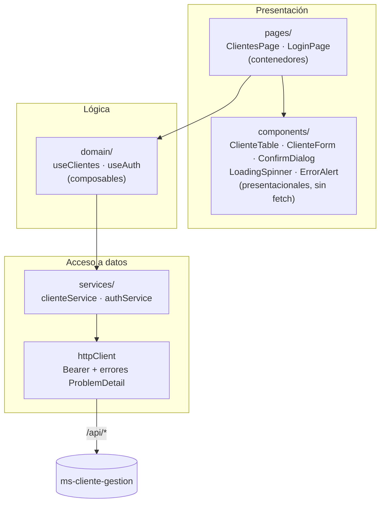

# ms-cliente-presentacion

Interfaz web de **gestión de clientes**: inicio de sesión, listado, alta, edición y baja de clientes, con estados de carga y mensajes de error. Consume la API de [`ms-cliente-gestion`](../ms-cliente-gestion/README.md).

|            |                                                                                       |
| ---------- | ------------------------------------------------------------------------------------- |
| Versión    | `0.1.0` (la misma versión etiqueta la imagen `eykcorp/ms-cliente-presentacion:0.1.0`) |
| Tecnología | Vue 3.5 (Composition API), Vite, JavaScript, Vue Router, Bootstrap 5 (solo CSS)       |
| Servidor   | Nginx: sirve la SPA y reenvía `/api/*` al backend                                     |
| Pruebas    | Vitest, Vue Test Utils, MSW; calidad con ESLint y Prettier                            |

## 1. Qué necesitas para levantarlo

| Requisito                  | Para qué                                              | Versión                |
| -------------------------- | ----------------------------------------------------- | ---------------------- |
| Docker y Docker Compose v2 | Levantar todo el sistema                              | Docker 20.10+          |
| Node.js y npm              | Solo para desarrollo, pruebas y build fuera de Docker | Node 22 (ver `.nvmrc`) |

## 2. Cómo levantarlo

### Opción A. Todo el sistema con Docker Compose (recomendada)

Desde la **raíz del repositorio**:

```bash
cp .env.example .env     # completa los secretos (ver README del backend)
docker compose up --build
```

Abre **http://localhost:8080** e inicia sesión con el usuario administrador definido en `.env`.

### Opción B. Servidor de desarrollo (recarga en caliente)

Necesitas el backend corriendo en `http://localhost:8080` (ver su README, opción B).

```bash
cd ms-cliente-presentacion
npm ci
npm run dev          # http://localhost:5173
```

Vite reenvía `/api/*` a `http://localhost:8080` quitando el prefijo `/api` (ver `vite.config.js`), igual que hace Nginx en producción.

## 3. Arquitectura

Sigue el estilo de **componentes frontend por capas**: la dependencia va de la interfaz hacia los datos y ninguna capa interna conoce a las externas.



```
src/
├── pages/        contenedores: orquestan estado y componentes
├── components/   presentacionales: reciben props, emiten eventos; accesibles
├── domain/       composables con la lógica (listar, crear, editar, eliminar, sesión)
├── services/     único punto que habla con la API (httpClient + un servicio por recurso)
└── app/          arranque: router con guard de autenticación y composition root
tests/            unit/ (Vitest) y support/
```

Decisiones a conocer:

- **Un solo punto de red:** ningún componente llama a `fetch`; todo pasa por `services/`.
- **El token no crea dependencias circulares:** `httpClient` recibe `getToken` y `onUnauthorized` por inyección desde el arranque.
- **Sesión:** el token vive en memoria y en `sessionStorage` (se borra al cerrar la pestaña); nunca en `localStorage`. Un 401 cierra la sesión y lleva a `/login`.
- **Seguridad en el navegador:** no se usa `v-html`; Nginx sirve una política CSP restrictiva (`default-src 'self'`).
- **Validación:** el formulario valida solo para ayudar al usuario; la fuente de verdad son las reglas del backend, cuyos errores por campo se muestran tal cual.
- **Accesibilidad:** diálogo propio con `role="dialog"`, foco inicial y cierre con Esc; mensajes con `role="alert"`; indicador de carga con `role="status"`.

## 4. Scripts

| Comando                 | Qué hace                                          |
| ----------------------- | ------------------------------------------------- |
| `npm run dev`           | Servidor de desarrollo con proxy a la API         |
| `npm test`              | Pruebas unitarias y de integración (Vitest + MSW) |
| `npm run test:coverage` | Pruebas con reporte de cobertura (`coverage/`)    |
| `npm run lint`          | ESLint                                            |
| `npm run format:check`  | Prettier (comprobación)                           |
| `npm run build`         | Compilación de producción en `dist/`              |

## 5. Imagen Docker

El `Dockerfile` usa dos etapas: Node compila la SPA y la imagen final es Nginx con los archivos ya generados. `nginx.conf` define el _fallback_ de la SPA (`try_files`), el proxy `/api/` → `http://ms-cliente-gestion:8080/`, compresión y cabeceras de seguridad.

```bash
docker build -t eykcorp/ms-cliente-presentacion:0.1.0 .
```
